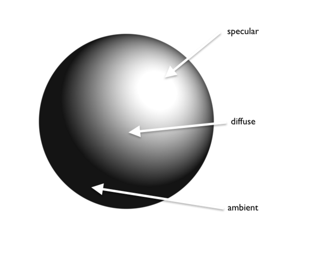

#Looking Outwards 7

## Applying color theory to digital media and visualization

[Link to article](http://dl.acm.org/citation.cfm?id=2792696)

Authors: Theresa-Marie Rhyne

The CIE XYZ color space is a based on experimental perception studies conducted by W. David Wright and John Guild
in the 1920s. The CIE 1931 XYZ color space, shown above, is designed for matching calibrated displays or printers. It is a
device independent color space.

A 3D Color Space by Albert Munsell.
 Each of these 10 steps is divided into 10 sub-steps
 to yield 100 hues with integer values.
 
• Chroma: measured radially from the
center of each slice. Lower chroma value is less pure, more washed out like a
pastel.