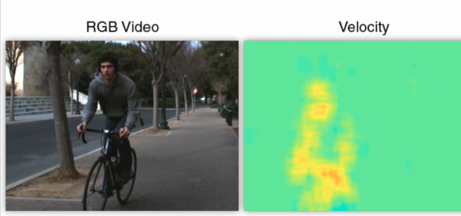

#Looking Outwards 8

## Doppler Time-of-Flight Imaging

[Link to paper](http://www.cs.ubc.ca/labs/imager/tr/2015/DopplerToF/)

Authors: Felix Heide, Wolfgang Heidrich, Matthias B. Hullin, Gordon Wetzstein 

A camera that displays the rate at which something is coming towards the camera or going away from the camera.

You can see here that it uses doppler based velocity imaging. 

Setup:
They use pretty standard time-of-flight cameras that a consumer could buy off the shelf. They coupled it with a regular RGB camera to create velocity maps. 

Applications:
This could help solve computer vision problems, including segmentation, recognition, tracking, super resolution, maybe motion deblurring, and navigation of autonomous vehicles.