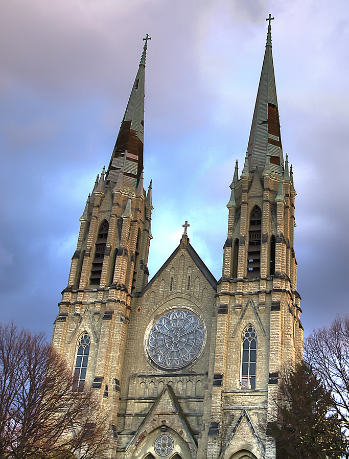
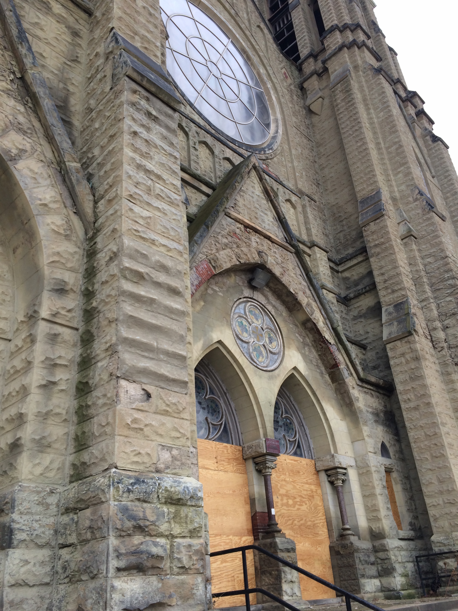
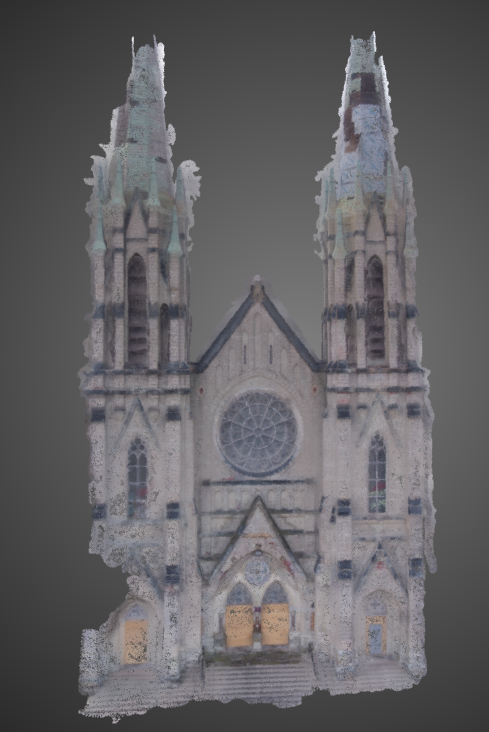
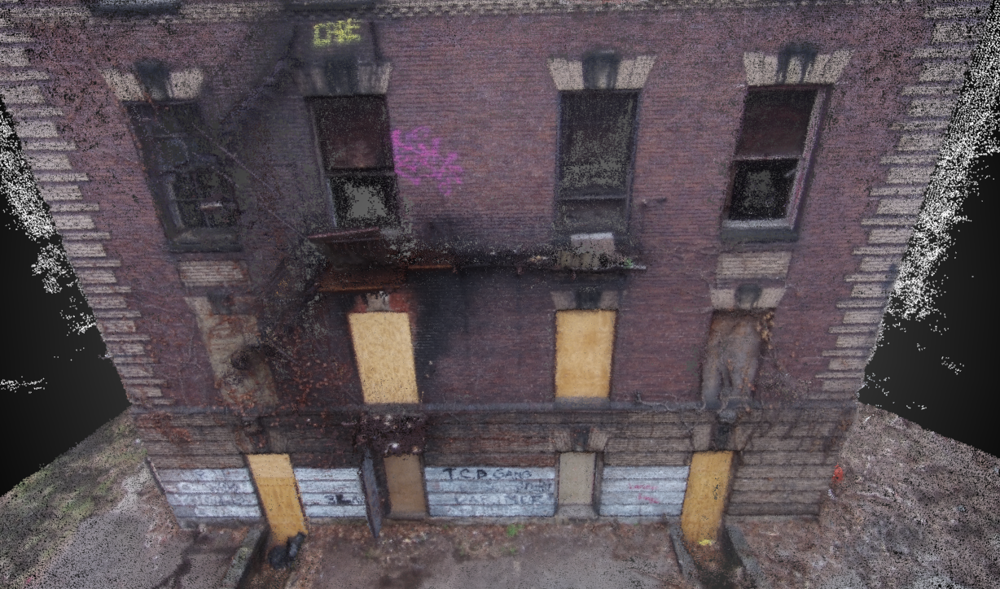
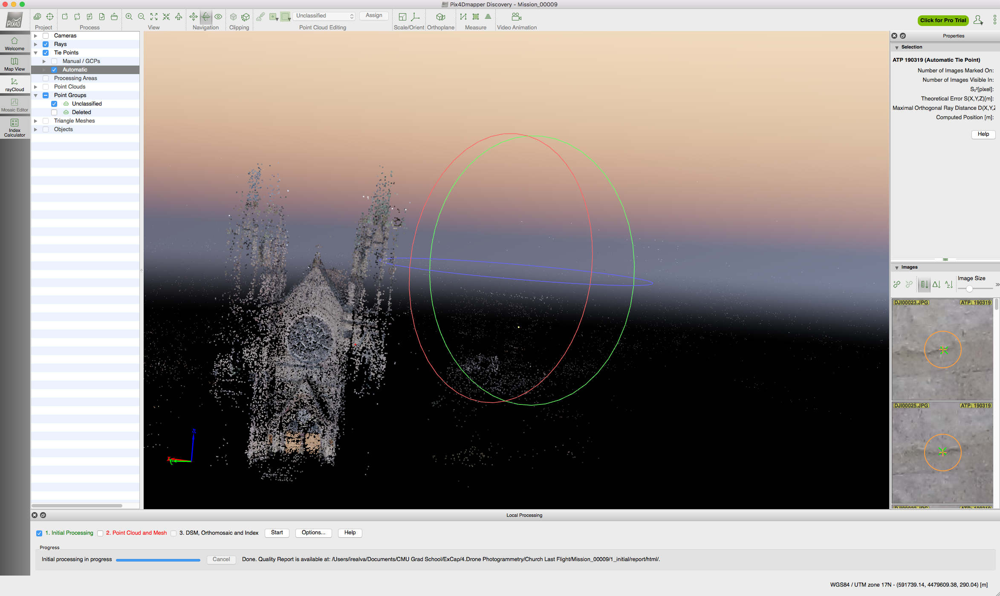
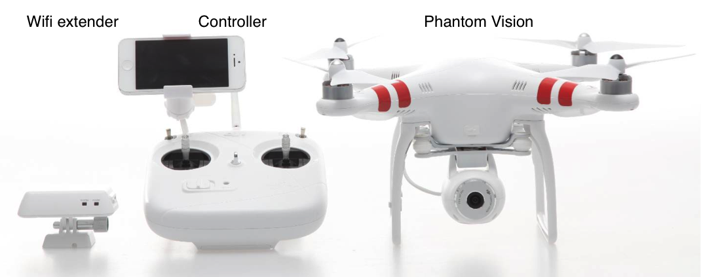

Drone Photogrammetry
===============================
For this project I captured the main façade of St. Peter and Paul's Church in East Liberty using drone pictures and photogrammetry. This grand and beautiful church was once at the center of a large German Catholic community based in the East End. It was built in 1890, rebuilt in 1909 after a fire, and finally abandoned in 1992 when the parish merged with five other Catholic parishes. The church's fate is precarious. Will it be demolished? Rebuilt? Or left to rot? Apparently in the winter, tiles from the bell towers fall on the nearby parking lot. 

I chose such a place for practical but also symbolic reasons. My first desire was to try to create 3D maps of larger blocks of land within Pittsburgh - but this proved difficult as I was booted out of parks and approached by the police twice. The only place I worked unbothered was around the church - an area that conveys decay unfortunately. If the church were to be demolished, a 3D model of its façade is a way to capture another representation of it for the future.

I also shot an abandoned school next to the church in a similar state of disarray. 

---

# The Goal
To capture a 3D model of an artifact that satisfies two requirements: 

* some of its qualities are hidden from daily commuters or anyone who mainly moves at the ground level
* because of its scale, the artifact is tedious or impossible to capture with some sort of handheld camera (aerial photography is widely used for photogrammetry, but who has access to a plane?!)

---

# Results

## Church

## School

---

# Challenges

## Flying a drone
A few weeks before the project proposals were due, I started practicing how to fly a drone. I started with the Parrot drone, a cheap, starter drone which is quite hard to fly because one has to fly it through a mobile app. The touchscreen controls give you very little feedback about the drone movement itself. 

I then upgraded to the DJI Phantom 1 - a model without a camera - to become familiar with the physical controls typical of most drones. 

Finally, I picked up the DJI Phantom 2 Vision - a model with a high quality camera - and started shooting. The Phantom 2 can fly higher than 400 feet! Though 400 is the legal limit in most countries. The reason its so easy to fly (with a bit of practice beforehand) is that the drone locks on to at least 6 satellites and flies in a semi-automated GPS mode. Even if you let go of the drone's controls, it will stay within a cubic volume of about 2x2x2 meters - even with high winds. 

Some example capture pictures:

## Finding a place to shoot
It should come as no surprise that drones are increasingly being regulated. I think anyone that has flown one can agree that this is good news. They *can* be dangerous that's why a good rule is to never fly over other people. I found it quite challenging to find a safe, quiet place to fly where I wasn't stopped by police or kicked out (the parks!). 

A few considerations about the legalities of flying:

* As of November 2015 it is illegal to fly a drone in Pittsburgh Parks
* As of December 2015 all drones will have to be registered with the FAA, the Federal Aviation Agency. They don't even have their registration site setup yet, but it will be up soon. 

## Merging aligned photo chunks

Because of the scale of the church and school that I chose to capture, I had to fly multiple missions to capture sufficient footage. During post processing, my photo chunks weren't aligning properly even though I was supplying GPS, yaw, roll, and pitch data about the drone's location and position for each image. After a few experiments I realized that in fact they aligned better *without* that data (i.e. performing a pure alignment based on the features in the images) for what I believe to be a simple reason: since there is a margin of error in the GPS and other outputs, I should NOT have callibrated in between flights of the same building. The callibration  changed what the values meant in absolute space. 

In general, even using GPS and drone data (without using something called a ground control point), the error of measurement will be 1 GSD (Ground Sampling Distance). Here is a GSD calculator that helps determine what that unit represents in different contexts: <https://support.pix4d.com/hc/en-us/articles/202560249-TOOLS-GSD-Calculator>

Lesson: callibrate once on site and then shoot a few missions. If you callibrate in between missions you won't be able to use the GPS data from the flights. 

## Dealing with a high-density point cloud and massive mesh

The Pix4D app gave me the option to create a model at half the scale of the real church and school. Even though I reduced the size, the church still contained 10M points and the school contained 2.5M. Though I used VBOMesh and the simplest camera in OpenFrameworks, my app still lagged at times. For the future, I'll have to reduce the point cloud density or find a way to optimize the ofx app. 

The mesh was also a hassle to deal with. The best way to edit it was on MeshLab. Unity takes a maximum of 60k vertices per model (more than that, and Unity breaks up the model for you) so for this project rendering something on Unity became problematic. 

---

#Overview of Process

There are more than a few photogrametry software solutions in the market that work well (Agisoft, 123D Catch, Memento, Photosynth, pix4D), but each one is tuned for a particular kind of use case and type of image. Agisoft doesn't process images shot with wide angle lens very well, 123D catch only works for small objects, Memento is still in beta and keeps crashing on me. For this project I used a software called Pix4D geared towards processing drone images that can help you integrate the GPS data captured by the drone quite easily. This improves the image processing tremendously, as the program has a pretty good idea of where the camera was positioned in space to capture each image. 

1. Once I'd setup my drone I chose some functions within the Pix4D app that allowed me to take a picture every 1 meter horizontally and 1 meter vertically that the drone covered. 
2. Next, I flew my drone from the ground up using an L shaped pattern. I covered each floor of the building before moving on to the next floor.
3. I exported my results to the Pix4D software on my computer and aligned the photos by chunks that corresponded to the 2-3 flights I made on each site.
4. I trimmed the point cloud and mesh in MeshLab. 
5. Rendered the point cloud using openFrameworks. 

## Quick, basic steps to fly a DJI drone and capture footage

These steps will particularly apply to the DJI Vision drone. 

Before starting: 

* Download the DJI Phantom app.
* Make sure the drone camera has a microSD card in it.
* Make sure the wifi extender is fully charged, the drone battery is fully charged, and the controller has somewhat new batteries.     

On site:

1. Turn on the physical controller and the wifi extender. Make sure S1 and S2 are in the uppermost position. 
2. Turn on the drone battery: it's a little tricky to turn on at first. You have to press the battery button twice and wait until the green lights progressively turn on. 
3. If the drone comes with a camera, flip the camera switch to "on", all the way to the right. 
4. Go to your phone's wifi settings and connect to the drone's camera wifi. 
5. Throughout all of this, your drone was setting up and locking satellite signals (you'll notice lights changing). Make sure you wait until the lights flash green before continuing. 
6. Now we have to callibrate the drone. Follow these instructions to callibrate it correctly or lookup a vidoe on YouTube: <https://blog.amain.com/how-to-calibrate-dji-phantom/> This is a summary callibration table straight from the DJI Phantom manual: 

7. Turn on the DJI Phantom app and verify that GPS is on. 
8. Go to the camera view on the app and you should be able to see a live stream from the camera.
9. Start the drone by moving to any of following controller positions: 

10. Navigate! 
11. You can take pictures and videos through the DJI Phantom app. 

There's a lot more to learn and consider. This is probably the absolute minimum you would need to fly a simple mission. 

---

# Code

The code in this repository should compile fine in ofx 0.8.4 with the supplied examples. To render in ofx 0.9.0, you need to change the mesh code within the openframeworks library. There seems to be an error with the way the load() function in the new version loads color. Instructions for that to be uploaded soon. 

You'll have to unzip the ply files because they were too large to upload to github.

---

# Special Thanks

Jen Liu
Daniel Campos