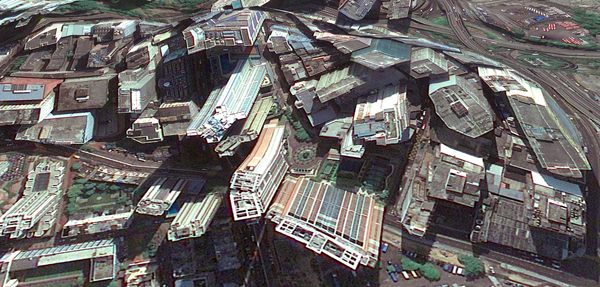
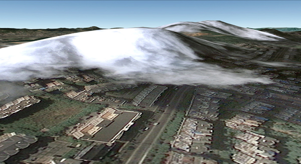

Clement Valla on Google Earth
=======

For this looking forward I wanted to go back to the example presented in class of Clement Valla's distorted Google Earth bridges. What's special about this work? Why is it relevant, can't we all take snapshots of Google Earth? I quickly found that Valla has been working with Earth for some time and built an understanding of how it changes over time. His work is accompanied by a text titled Universal Texture with really insightful comments about the nature of representing reality through maps in our data-driven times. 

## Background

Valla was struck by inconsistencies in the texture mapping of 3D models on the surface of the earth to aerial photographs of that surface. He writes: 

> I realized the situation was actually more interesting — these images are not glitches. They are the absolute logical result of the system... They are seams which reveal a new model of seeing and of representing our world - as dynamic, ever-changing data from a myriad of different sources – endlessly combined, constantly updated, creating a seamless illusion.

I didn't know this but in retrospect it seems obvious: Google has a patent for mapping textures onto a 3D model of the earth, which Valla calls the Universal Texture:

* Asynchronous multilevel texture pipeline: <http://www.google.com/patents/US6618053#v=onepage&q&f=false>
* WebGL Earth: <http://data.webglearth.com/doc/webgl-earthch2.html>

The continuity we perceive in the Google Earth represetnation of the world is just an illusion. These spaces are the result of a combination of 2D and 3D images and models all patched together to form a very specific - "useful" - view of the world. 

> When these photographs get distorted and stretched across the 3D topography of the earth, we are both looking at the distorted picture plane, and through the same picture plane at the space depicted in the texture. In other words, we are looking at two spaces simultaneously... Google Earth is essentially a database disguised as a photographic representation.

## My Experience

What I really like about Valla's text and his accompanying explorations is the framing and clarity with which he exposes his ideas. His art pieces are not just that, they are a historical archive of a temporal and virtual space that is constantly updated and "improved". 

When you see Google Earth as one big database, it becomes clear why parts of South America remain unmapped in 3D or why slums will most probably never appear acccurately, or why territorial boundaries (think China expanding in the South East ocean) are hard to distinguish on Google Earth. The data itself either doesn't exist or exposes some kind of bias. And this is the beauty of the current state of Google Earth; the more accurate it becomes, the more photorealistic, the more we might forget that these maps reveal imbalances in power and  in access to data. 

As Valla points out, "Progress in the Universal Texture promises to give us a smooth and continuous 24-hour, cloudless, daylit world, increasingly free of jarring anomalies, outliers and statistical inconsistency." But the world is not so, and artists like him expose the flaws of that ideal within the system itself. 

What aggravates the problem today is that algorithms do all that work in the background, "...the map is automated to such a degree that it becomes easier to believe it is truthful." The biases don't go away, but we're confronted with new problems: can an algorithm be objective? if so, how? whose biases remain in the maps, those of the people who collected the data or the developers of Earth algorithms? 

## References

* Universal texture by Celement Valla: <http://rhizome.org/editorial/2012/jul/31/universal-texture/>
* Interview Clement Valla: <http://blog.art21.org/2014/08/11/the-future-of-mapping-an-interview-with-clement-valla/>
