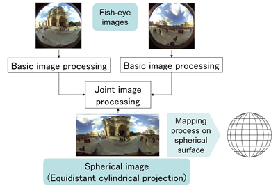
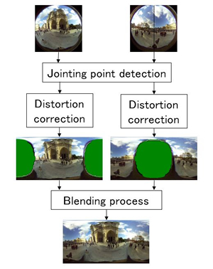
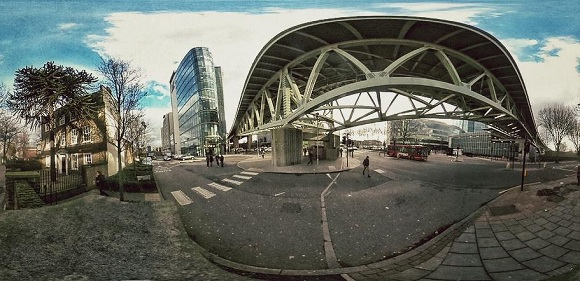

Tutorial: Ricoh Theta M15 360
========

Ricoh has created a series of small cameras that carry a fish-eye lens on both the front and back, allowing you to take full 360 degree spherical panoramic images and videos. Videos are unfortunately limited to 3 minutes, but include basic audio. Video quality isn't amazing, but I'm sure there's something clever that can be done with this little camera. 

It's really hard to get your fingers out of the way when shooting spherical pictures. Keep in mind that a benefit of using the camera by pairing your phone (more of that below) is that you can remotely trigger the camera via wi-fi (say if its mounted on a tripod).

Finally, biggest tip I can give you that will go a a long way: make sure you clean the lenses before shooting! They get smudges very easily - smudges you won't even notice until you process your pictures!

How it works
----

The Ricoh camera features two super-wide-angle lenses (fish-eye lenses) position on both faces of the device. Thus there are two infletction optical systems that are symmetrically-positioned. Incided light from each wide lense is reflected by a prism mirror, angled 90 degrees, and received by an image sensor (CMOS sensor). Two images obtained with two image sensors are thus synthesized to generate a complete spherical image.

  
  
Ricoh does some pattern matching processing to detect where the two images should join, then converts the two images to spherical-image format and finally blends the two images together. 

***

Setup
----
* Download the basic smartphone app: <https://theta360.com/en/support/download/>
* Download the desktop app if you want to use Ricoh's frame stitching software: <https://theta360.com/en/support/download/>

#### Pairing the camera with your phone
The best way to interface with the Ricoh camera is through a smartphone app. The camera itself features just a few buttons and no screen. It can be hard to verify if a picture/video was properly taken without the app. Pairing your phone and the camera via wi-fi is annoying the first time, but then quite simple.

Step 1: turn the power button on	
Step 2: press the wireless button	
Step 3: Go to the wi-fi menu on your phone	
Step 4: Select the SSID of the camera from the network list. In this case: "THETAXN00117706". The password is just the numbers part of that. In this case: "00117706".

 

Step 5: If you now open the dedicated app on your phone, the wireless lamp on the camera should turn blue.	     

***

How to shoot still images
----

*If you followed the steps above*, you should have paired your camera in "photo mode", meaning you'll only be able to shoot still images, not video. The app should look like this: 

 

From here you can either take a picture using the shutter button on the camera or taping the big green circular button from the smartphone app. The benefits of using the app are that you can set ISO sensitivity, shutter speed, white balance, and internal shooting conditions to suit your needs. For example, if you check a still image and feel that it is too bright or too dark, adjust the brightness and retake the photo to obtain the desired brightness.

*If you did NOT pair your phone*, you can take still images by simply pressing the camera shutter button. Ricoh warns that orientation information may not be recorded correctly if the camera is tilted when shooting. You should try to keep your camera as upright as possible. 

#### Keep in mind
* If a still image is taken while connected to a smartphone with a GPS function enabled, position information is recorded for the photo.
* You can use shoot in: manual, shutter speed priority, ISO priority, or auto by using the app. You can only shoot in auto if you do NOT pair the phone. 
* For still images, camera features ISO 100-1600
* You can shoot as fast as 1/8000 per second for both images and video
* Although the pictures give you a complete wraparound view, it does matter which way you point the camera. If your scene is bright on one side and dark on another, try to expose each of the lenses to half-bright, half-dark. Otherwise the two pictures will have differing exposures and you will see the join when they are stitched together
* Images saved in jpg format

  
***

How to shoot video
---
The steps are practically identical to the still image setup, except that when pairing the camera you must *press the power button AND the wireless button at the same time* (step 1 + 2 in the pairing process are done simultaneously). If you paired the camera correctly, the smartphone app should look like this: 

#### Keep in mind
* For video, camera features ISO 100-400
* You can only shoot 3 minutes
* Shoots 15 frames per second, 1920 x 1080p video
* Fixed focus range of 3.9" to infinity renders most subjects in focus
* Videos saved in mov format

***

Transferring files
---
There are several ways of transferring files, mainly either directly from the camera or from your phone.

1. Direct transfer from Ricoh camera: If you connect the camera via USB, you might be able to transfer files directly to your hard drive. I've only done this on a Mac with the "Image Capture" app.

2. Direct transfer from Ricoh camera using Ricoh software: Given the variety of platforms, just follow instructions here <https://theta360.com/en/support/manual/m15/content/menu-pc.html>

3. Transfer to smartphone: WARNING - The size of still images is automatically reduced when images are transferred to a smartphone. But if you still want to do so, then go to the main app menu, select the "Camera" button and select a list of photos to transfer. Looks like this: 

***
Viewing 360 images and movies
---
#### Images
You can use Ricoh's own software: <https://theta360.com/en/support/download/>. It provides pretty minimal functionality and will only let you export to their own theta360.com social sharing site. Not great. The raw, unassuming image of a pothole looks something like this (first pic) next to its processed version (second pic). Within the app, you can move around in the processed one. 

       
   
You can import the images into Lightroom or other photo processing applications, which convert them into long rectangular images like so:

#### Video

I have not tried uploading video to YouTube or Cardboard, but apparently the videos are directly shareable. The process will most probably entail: 

1. Converting the .mov files to .mp4. You can do that with Ricoh's desktop app, it will create an .mp4 file in the same folder
2. Adding 360-degree metadata to your file. You can do so here: <https://support.google.com/youtube/answer/6178631> 

I'm sure there is a better way of processing these files, if anyone has already played with 360 video please edit this tutorial. I think [Premier](https://www.youtube.com/watch?v=fcrrskHYpBg)can handle this kind of footage. 
***

Resources
---
* Full Ricoh m15 manual: <https://theta360.com/en/support/manual/m15/>
* Ricoh will be releasing an API and beta SDK for independent app developers

