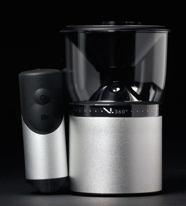
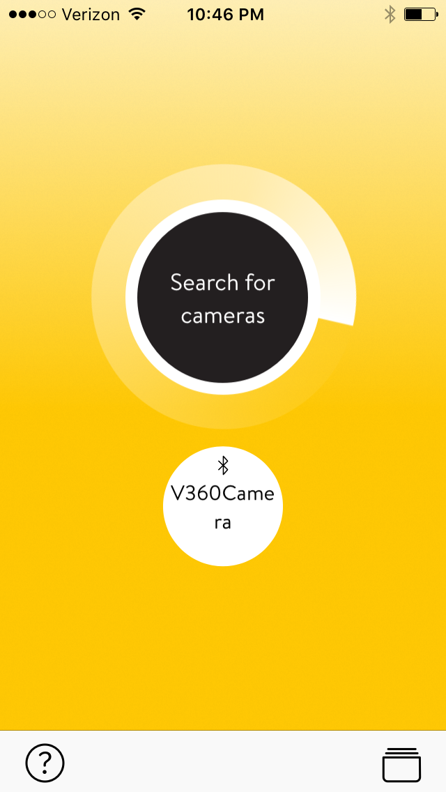
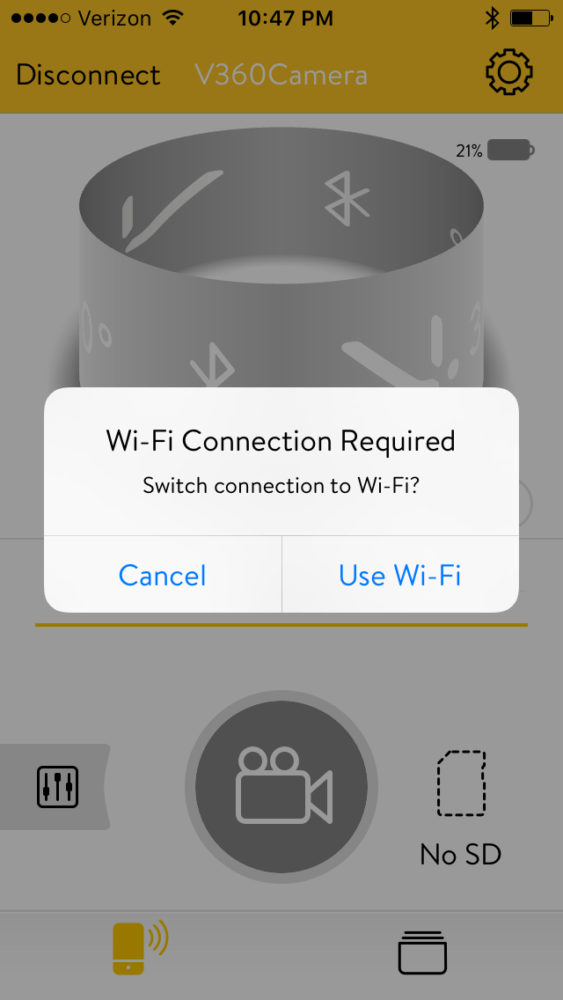
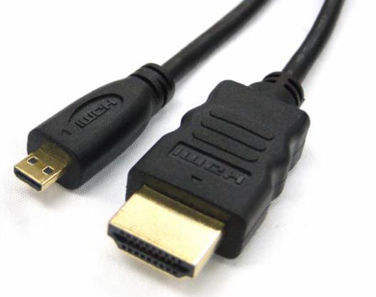
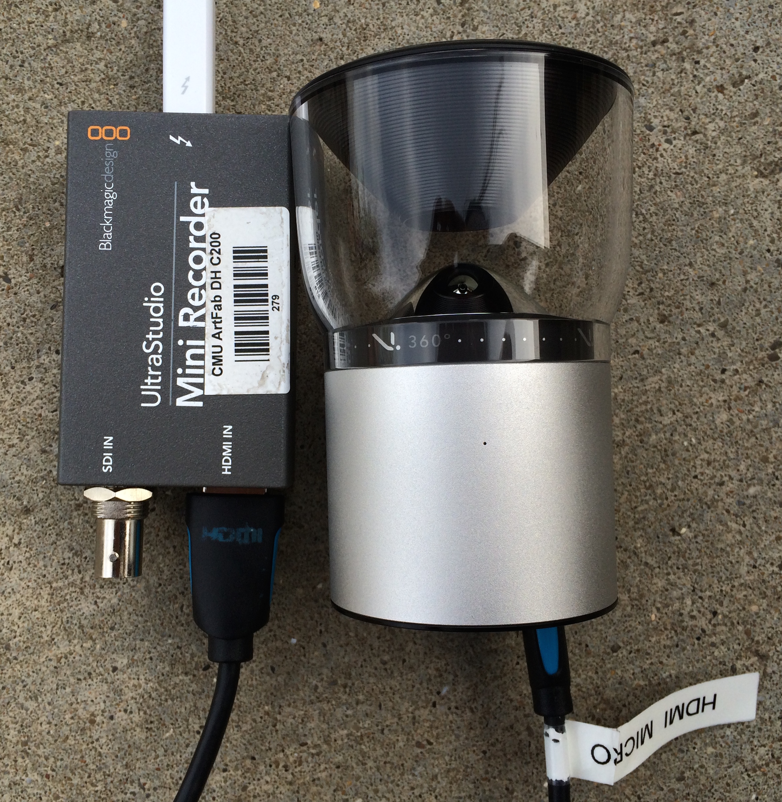
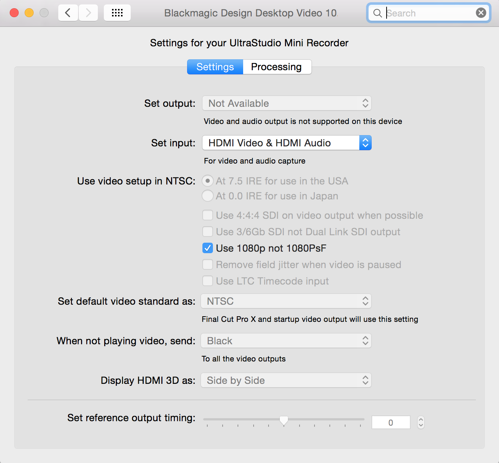
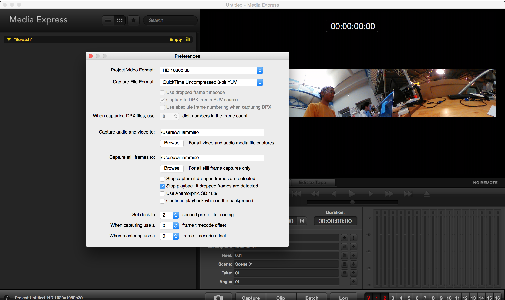

Tutorial: V.360 HD Camera
========

This camera is somewhat annoying to pair up with your phone/computer and has a terrible battery life. It is clearly a first generation camera product. That said, if you do manage to capture 360 video, it can be pretty fun to play with. 

Pros:

* This camera (and remote) is watertight for up to 30 minutes down to 3.3 feet (1 meter).
* Relatively small and easy-to-carry 360 camera.
* Can record up to 6480x1080 pixels. 

Cons:

* Video quality is not very good. 
* The battery life is TERRIBLE to say the least. Make sure you charge the camera to 100% before use.
* The camera has a life of its own sometimes. You'll have to restart it (take the battery out) if you get connection problems. Sometimes it unpairs from the phone for no good reason. 
* There is a HUGE lag if you use the mobile app. This is why we suggest capturing live feed through your computer. 

Pairing the camera with your phone
----
Step 1: Download the smartphone app: 

* <https://itunes.apple.com/us/app/v.360-camera/id930374934?mt=8>
* <https://play.google.com/store/apps/details?id=com.pocketlifestyle.v360&hl=en>

Step 2: Push the battery into the camera. This will turn the camera on, there are no buttons on the actual camera (which is actually annoying).

Step 3: Turn bluetooth on on your phone and open the V.360 app. Pair the camera with your phone. If it asks you for a code, type 0000. 

Step 4: To adjust shooting settings, you'll also have to pair the app and camera over wifi. Go to "settings" on the mobile app, and activate the camera hotspot. This will create a wifi network called "V360 Camera".

Step 5: Navigate to your phone's wifi settings and connect to "V360 camera network".

Step 6: Go back to the V.360 app and you should be able to see a live view of the camera feed.

Step 7: Adjust any settings like shutter speed, aspect ratio, and color format.  	  

You can also skip steps 3-7 altogether and capture video/images using the camera's remote control. The control connects to the camera via Bluetooth, but it is completely unclear when the camera is actually recording or capturing anything. 

Capturing a live feed from your computer
----
(Tested on a mac)

What you need:

* A thunderbolt to thunderbolt cable
* An HDMI to mini HDMI cable
* A Blackmagic Design Ultra Studio Mini Recorder (other Black Magic recorders such as the Blackmagic Intensity did not work!)

Step 1: Download and install the Black Magic Desktop Video Software, version 10.1.4. The setup will ONLY work with version 10.1.4. <https://www.blackmagicdesign.com/support/family/capture-and-playback> 

Step 2: Connect the camera to an "Ultra Studio Mini Recorder" via an HDMI to mini HDMI cable. And connect the Mini Recorder to your computer via a thunderbolt to thunderbolt cable. You won't be able to see the feed on your phone anymore.

Step 3: Navigate to your system preferences (on a mac) and look for the Black Magic Video Software preferences. Make sure you check the option for "Use 1080p not 1080 PsF". Settings should look like the following:

Step 4: Download the VDMX Black Syphon application. <http://vdmx.vidvox.net/blog/black-syphon>

Step 5: Open up the Black Syphone application on your computer. Select HD 1080p as the input format. You should be able to see a small live feed from your camera. This indicates that the connection is working.

Step 6 (Recording with Black Magic software): Use the Blackmagic Media Express software that comes with the Video Desktop installer. This will allow you to record and playback videos. They are captured as non-spherical panoramas. Make sure you go to preferences within the Media Express and click on "Stop playback if dropped frames are downloaded". 

OR 

Step 6 (Recording with openFrameworks): Download this add on for the Black magic: <https://github.com/kylemcdonald/ofxBlackmagic>

OR 

Step 6 (Recording with something else): You can apparently use Adobe Premiere or After Effects to record a feed, but we didn't try it out. This manual has more info: <http://documents.blackmagicdesign.com/DesktopVideo/Desktop_Video_Manual_2015-03-31.pdf>
  

Viewing 360 images and movies
---
Refer to the Ricoh tutorial: <https://github.com/golanlevin/ExperimentalCapture/blob/master/students/irene/tutorial-ricoh/tutorial-ricoh.md>

With most common video editing software, the V.360 video captures will show up as two stacked horizontal videos. 

Resources
---
* Download the PC/Mac Desktop video converter: <http://www.vsnmobil.com/products/v360>
* Black Magic Desktop Video manual: <http://documents.blackmagicdesign.com/DesktopVideo/Desktop_Video_Manual_2015-03-31.pdf>

