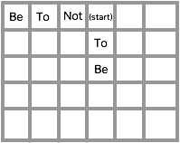
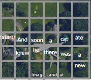
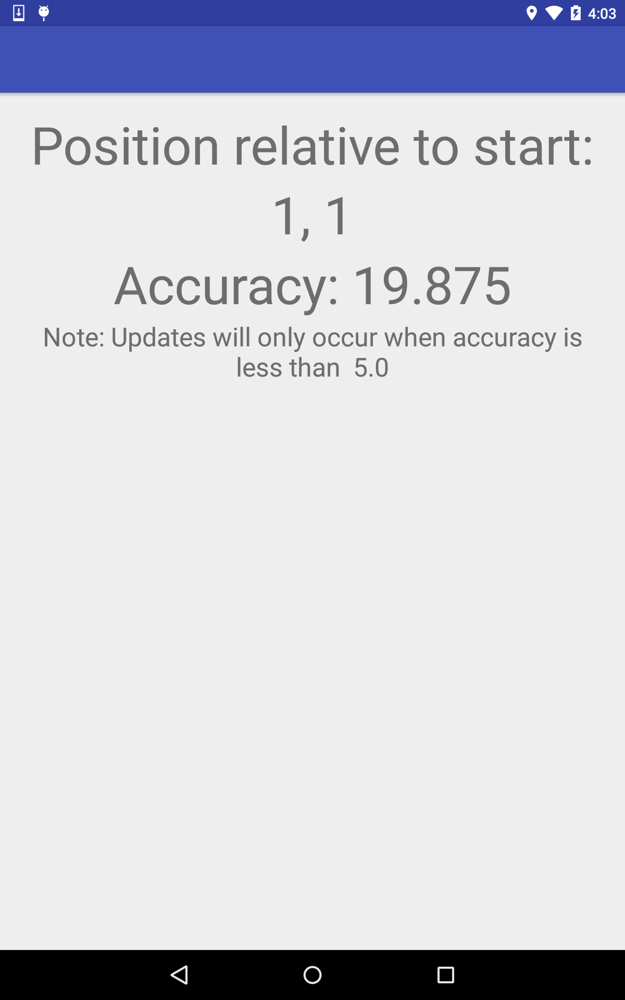

# Geographic Story Builder
##by Kevin M. Karol

[Project Code Repository](https://github.com/kevinmkarol/geographic_story)

For my final project I created an Android application which breaks the world into a grid using Latitude and Longitude, and then allows the user to record brief (2-3 second), spatially indexed audio clips as they navigate their environment.  Initially, the user is prompted to provide audio to fill each empty square they enter, however, once seed audio is in place, cells will randomly prompt the user for updated recordings (given the context of the seed audio they've been walking through), allowing the overal recording tapestry to evolve dynamically.

Figure 1: A simple (slightly contrived) example of text in space

Although branching narrative has been explored in many different mediums, one of the aspects that makes this geographic approach to their construction insteresting is that it is in many ways dependent on and derived from the infrastructure of the environment.  Where there is a branch in a path, there is a branch in the text, and what happens when two paths telling distinct stories intersect?  

Figure 2: How does infrastructure influence the paths the recorded text can take?

Additionally, the contextually based continual re-recording of the audio on the map means that every time through a space there is something new to discover, while still maintaining a degree of structure and coherence.

Figure 3: The visual interface for the application.  The application also features audio cues to prompt when sounds are being recorded.

###Future Work

Many of the pieces are already in place to allow an individual's recorded audio to be shared with other users through a centeral server.  Future explorations into this additional collaborative component will result in a tapestry of recordings and contextual understandings which will hopefully create many surprises for the user as they explore the world around them.
