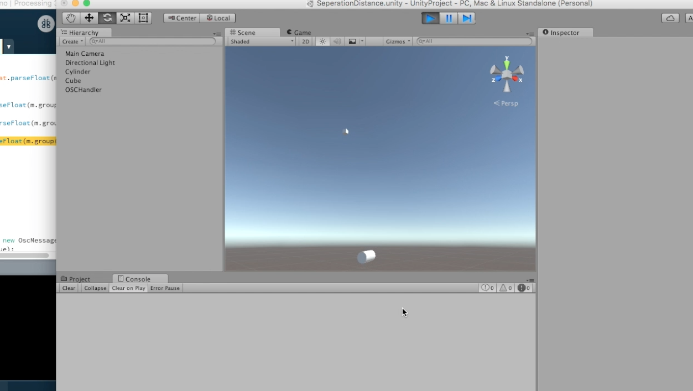

#Project 2: An Object
## Sonic Scanner by Kevin M. Karol

[Project Code Repository](https://github.com/kevinmkarol/sonicScanner)

My first project was an attempt to create an ultrasonic 3D scanner using a 9DOF position sensor and an ultrasonic range finder.  Using a custom Arduino board, processing and the Unity3D engine, I created a pipeline by which the angle and distance information coming from the sensors could be visualized.  Being able to visualize this information quickly made it evident that data smoothing would be essential to creating an acurate picture of what the sonic range finder was seeing.

Although the final product is nota full scanner, it does contain many of the elements that would underly such a creation.  In some ways the final product provides insight into how the sensors are working by taking the invisible ultrasonic information and visualizing it within the unity engine.

