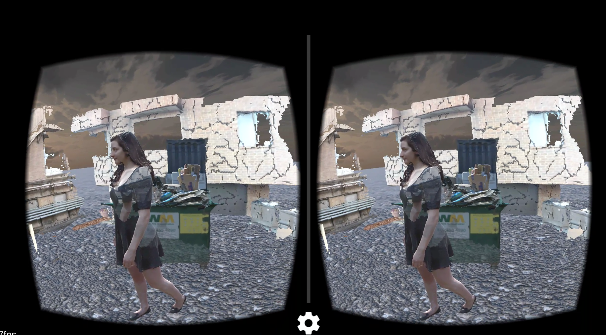
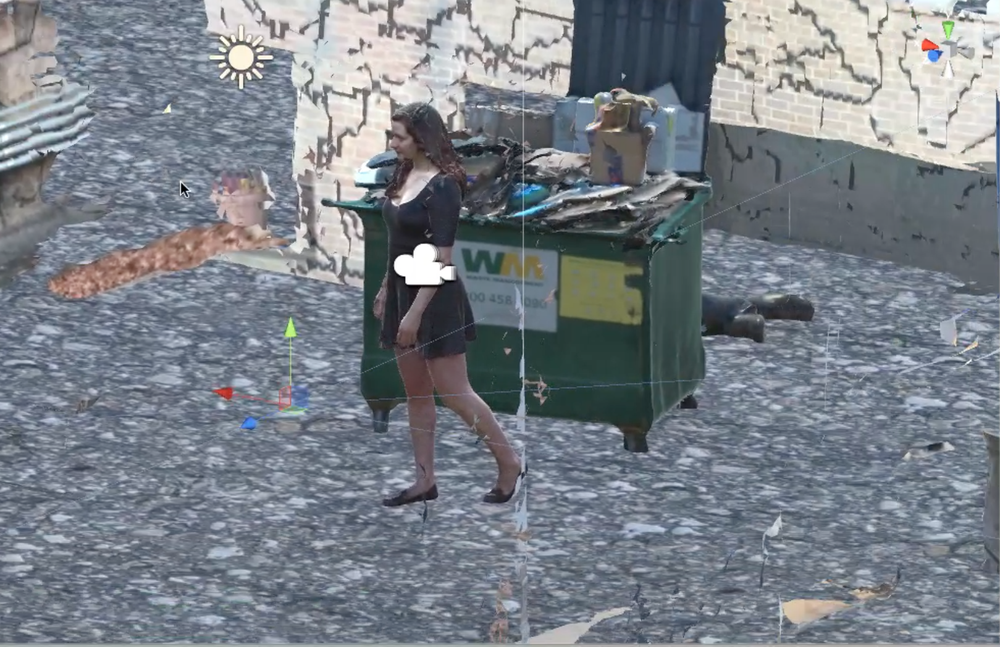
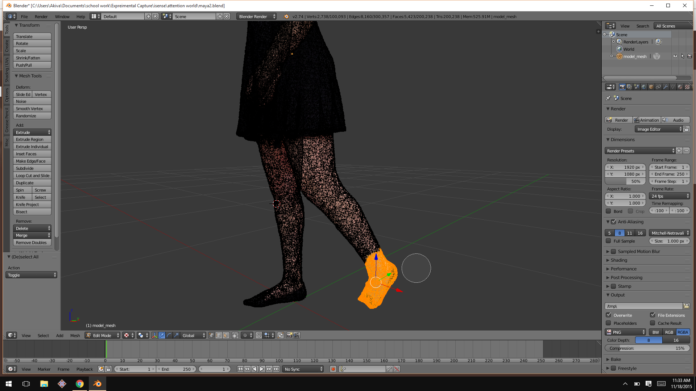

#Project 3: A Landscape
## Attention World by Akiva Krauthamer and  Kevin M. Karol

[Cardboard Experience](https://youtu.be/IV4lkjC7EQY)
[Unity Setup](https://youtu.be/bDYgj_K7nuY )
[Project Code Repository]()

For this project we created a constructed landscape to be viewed through Google Cardboard VR on which through the process of observation the viewer has an effect.  As the viewer looks around the environment, whatever they are looking at begins to slowly fade out of existence.  As a result, the viewer must take in what they can of the environment while under temporal pressure.  We also played with the way this transparency and eventual disapearance of objects could create a more dynamic viewing experience by allowing  the viewer to discover new layers of the image as their initial impression disapeared.

To create this VR environment, we used the iSense camera to capture 3D models of locations, objects and people.  We constructed these models into a charged image.  This approach was taken instead of capturing a found space in order to build an experience that was charged and would draw the eye.  Since a major portion of the experience is how the viewer effects the world we wanted to ensure that that affect had some meaning or purpose, rather than simply erasing the space.

The models were then processed through blender and broken down into smaller chunks.  Unity is unable to break down models or meshes elegantly during an experience, so instead we created our own piecemeal objects which could then be altered and destroyed independently of the full 3D model.  While initially we were concerned that this might not feel as "truthful" to the eye tracking experience, the broken and fractured natrue of some of our spacial scans ended up lending a logic and aesthetic coherence to the way in which parts of objects disapear.

Related Work
[World Skin](https://www.youtube.com/watch?v=I6NRSD7fBTw)
[Zerseher](https://www.youtube.com/watch?v=Gq79PW4hIGw)