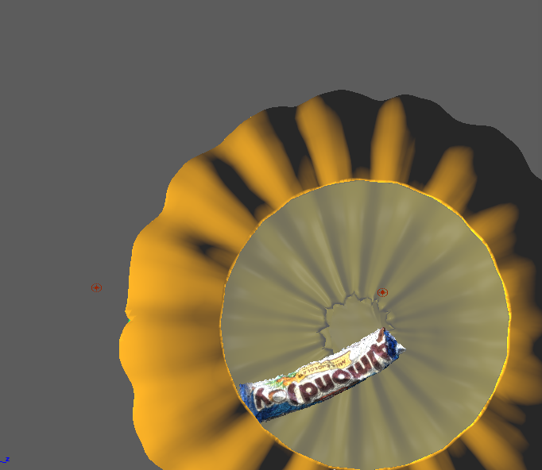

<<<<<<< HEAD
** Final Project Proposal **
=======
**Final Project Proposal**
>>>>>>> f7fb3075f734025850c8c7169c7e4e13e74d0fe9

I'd like to modify my first project ("An object") by further polishing my current progress in Unity3D. For my first critique, the status of my progress was completely static, having only assembled the photogrammetric candy bar and pumpkin model together but not in the context of the interactive state. Ideally, I'd like to make the final rendering of the project a simple user controlled virtual space in which my original themes of loneliness and rejection are better conveyed.

<<<<<<< HEAD

=======

>>>>>>> f7fb3075f734025850c8c7169c7e4e13e74d0fe9
