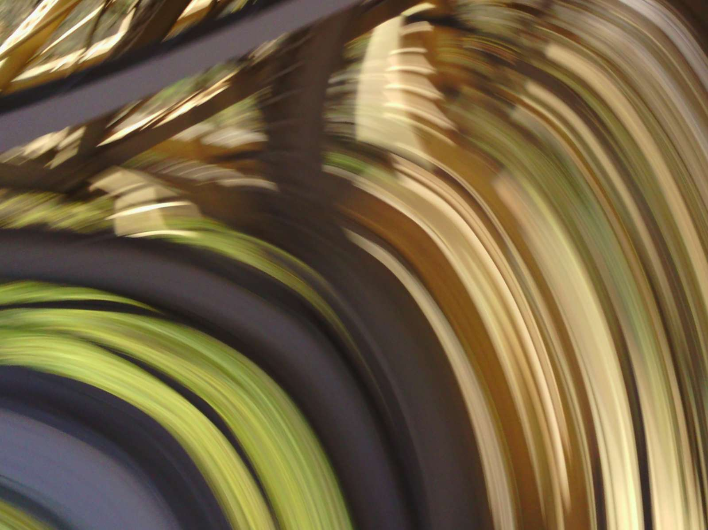
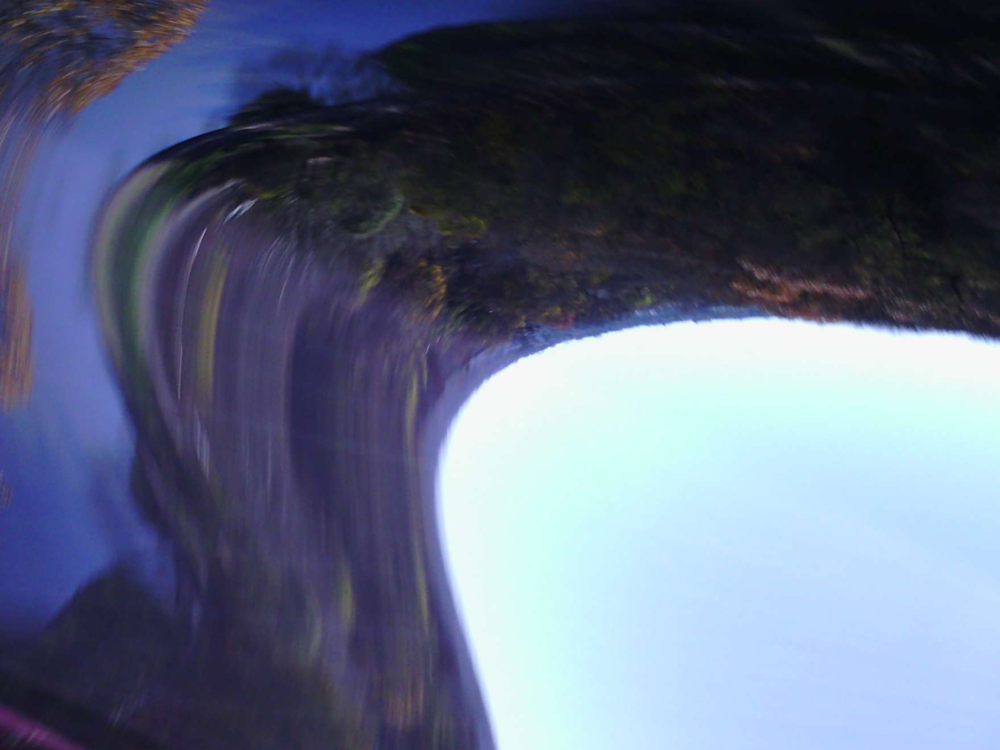

#Project 3: Clip + Kite

I tied a Narrative Wearable Camera to a kite and tossed it over the side of the bridge overlooking Schenley park. As the wind catches the kite with the camera taking snapshots every thirty seconds, the erratic movement creates warped images of the surrounding environment, numerous unintentional selfies, and a slitscanning effect. 

With the resulting images, I did postprocessing in Photoshop to knit images together to mimic the movement of the kite using transformation and painting techniques.

