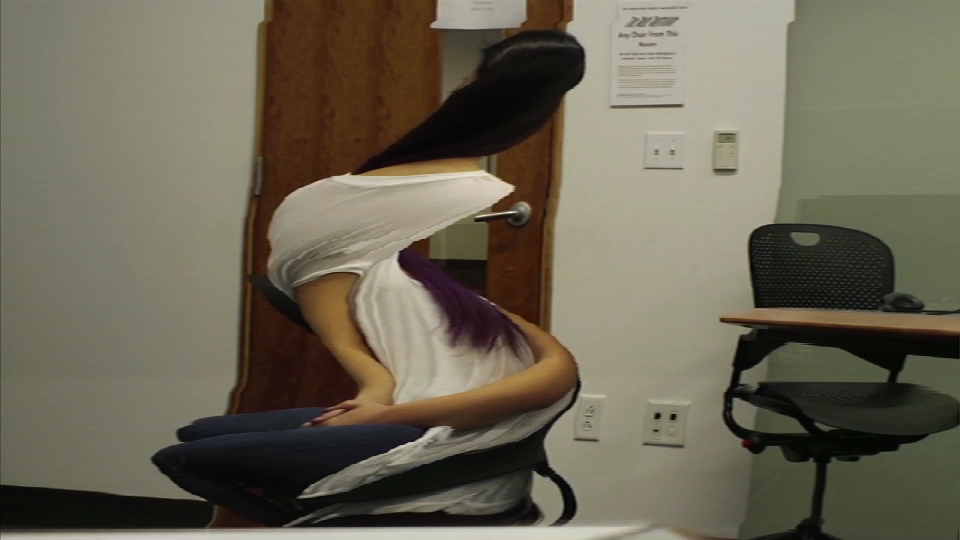
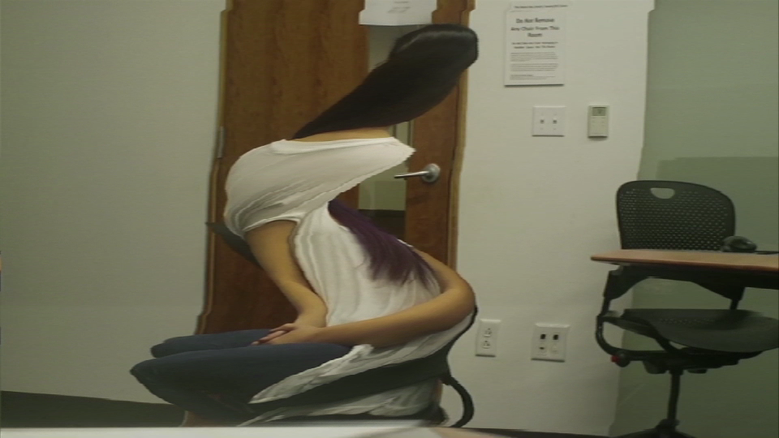

## Project 3: Disproportions
#### [Michelle Ma](../michelle/index.md)
-
#### Project Video

<!---->

-

#### Concept

My original idea for this project was to combine slitscanning with photogrammetry in order to create surreal portraits reminiscent of Salvador Dali's landscapes. My sources of exploration came from [Golan's Informal Catalogue of Slit-Scan Video Artworks and Research](http://www.flong.com/texts/lists/slit_scan/) and [Memo Atkin's Volumetric Slitscanning Examples](http://www.memo.tv/volumetric-slitscanning/).

I invited several of my friends to the Kinoptic Dome in order to capture their movements for intervals of 3-5 seconds. Ideally, I would have liked to use the panoptic dome for the video data. However, those resources were not available to me so I switched gears to point cloud data. Keep in mind that there was 80GB of point cloud data for 5 scenes, each being 3-5 seconds long. In addition, I really struggled with finding the right software to handle the data but finally settled with OpenFrameworks and MeshLab to convert the point clouds into meshed OBJs. After that, righting the program to manipulate the point cloud data was fun and fluid to write!

The mesh data actually is not very strong from these kinects, so the results have more of a glitch aesthetic. I am more drawn to the point cloud screen shots from the OpenFrameworks viewer.

-

#### WIP

I still have my hopes up for slit scanning photogrammetry! I have the processing script written and ready to go. You can see the script [here](../michelle/SlitscanPhotogrammetry) with a few test files. Displayed below are slit scans from a stereo camera. The next step for me is to find some data from multiple angles or set up an intense rig in order to be able to actually perform photogrammetry. I may also be able to just work with stereo slitscans and transfer them to a 3D viewer such as Google Cardboard.

 

-

#### Process

Most of the technical aspects came from learning how to manipulate point cloud data. Originally, I was guided towards the [Point Cloud Library (PCL)](http://pointclouds.org/), which ended up failing. I was not able to install the program properly since it requires up to 10 additional libraries. Much thanks to Caroline Record for setting me up with OpenFrameworks instead!

*Processing*
- Align the timeframes of the videos and place in the data folder
- Scan in each video one at a time using the Processing script
- Feed into Agisoft Photoscan Pro

*Kinoptic Dome Data*
- Extract ply files
- I highly advise using the command "for F in *.gz; do gunzip $F; done" since their files are tarred

*OpenFrameworks*
- Download OpenFrameworks v8.4 (IMPORTANT: v9.0 does not load Point Cloud colors properly)
- If you upgraded to XCode7, read the [post by ruohoruotsi](http://forum.openframeworks.cc/t/fix-for-xcode-7-and-of-0-8-4-opensslconf-h-not-found/20800/6) to fix the bug in v8.4
- Put the ply files in the bin/data folder of the app
- Use ofMesh to manipulate the point cloud data
- Export slitscanned ply files

*MeshLab*
- Import ply file
- Clean up extraneous points
- Build normals
- Build the mesh
- Build the colors
- Add texture data
- Export as an OBJ

-
#### Links
- [More Project Images](https://github.com/michell3/Photos/tree/master/slitscan)
- [OpenFrameworks Source Code](../michelle/PointCloudSlitscanning)
- [Processing Code](../michelle/SlitscanPhotogrammetry)

-
#### Special thanks to
- **Yu Mao** for allowing us to use the Kinoptic Dome
- **Jenna Choo**, **Jordan Cox**, **Andy Liu**, **Patrick Yurky**, and **Monisha Gopal** for being my subjects
- **Caroline Record** for getting me set up with OpenFrameworks

