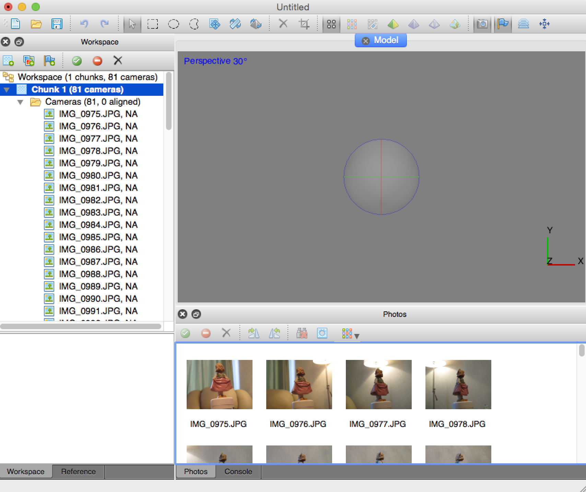
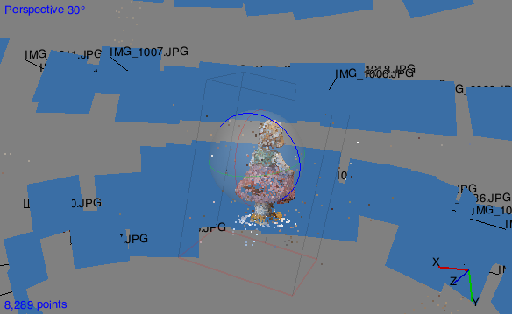

## Tutorial: Agisoft PhotoScan Professional Edition

In this tutorial I will go over the basics of generating an OBJ file using [**Agisoft Photoscan Professional Edition**](http://www.agisoft.com/). All of this information and more can be found in the official user manual linked below. Note that this tutorial is for version **1.1.6** and uses **Mac OSX** screenshots but this can also be used on **Windows** or **Debian/Ubuntu**. Also note that I will be using the [**Doll Sample Data**](http://www.agisoft.com/downloads/sample-data/) that can be found on the Agisoft website.

--
### A Note on Taking Photos

I won't be going into detail about how you should take your photos, but you should generally have a sample space of 60-100 photos. The user manual linked below goes into more detail about how you take your photos.

--
### Installation

Go to the [installation page](http://www.agisoft.com/downloads/installer/) on the Agisoft website and download the professional edition installer for your operating system.

After the download, open the application.

Enter your license code or continue in demo mode to activate your software. If you use demo mode, be aware that you cannot save the project, export reconstruction results, or use some Python commands. After activation, you can move on to using the program.

--
### The Agisoft Workflow

Upon opening the software, you are faced with a new project window.

The left panel is the **workspace** where you can manage your **cameras**. Cameras are basically the camera perspective contructed from each photo you upload. In the workspace you can add and remove cameras, manage chunks, and etc.

The bottom panel is for photos, so you can preview and manage your thumbnails.

The 3D view is where you can see your cameras, point clouds, and/or mesh once you've constructed them. To navigate the 3D view, you can **click + drag** to rotate, **ctrl + click + drag** to pan, and **shift + click + drag** to zoom.

Lastly the toolbar has icon shortcuts for most of the functions that you'll be using. In this tutorial I will just be accessing those functions through the **menu bar**. And within the menu bar, most of the functions you need for reconstructing a pointcloud or mesh are found in the workflow menu. In order to export an OBJ, we will basically be hopping down the menu in order to perform the following steps:

1. Add photos
2. Align photos
3. Build Mesh
4. Build Texture

Throughout these stages, you can use the functions under **View**, **Tools**, and **Photo** to do corrective changes and etc. Also note that you should always save your projects, which come in the **Photoscan Project File format (.psz)**.

--
### Adding Photos

You can add photos by going to the Wokflow menu, or you can click the second icon in the Workspace toolbar. Then, through the file browser, you can select your photos.

Once you have finished your upload, your Workspace should be populated with cameras and your photo thumbnails should appear in the bottom panel.

To get the best photogrammetry result, you need to filter out cameras that you don't need.You can do this by selecting one or several cameras from the workspace, right clicking, and disabling/enabling/removing your cameras. Once you are done, you are ready to align your photos.

--
### Aligning Photos

The process of aligning your photos takes the longest and is basically when the camera perspectives are generated. You can perform this function by going to the workspace menu after you have added your photos. After you select this option, you may change the preferences or leave them be. When you proceed, a progress bar will appear and you can probably go out and get a coffee and come back to find that it is done. When the process has completed, you should see the cameras in your 3D view.

--

### Building a Mesh and Texture

To build your mesh, you just go to the Workflow menu and select "Build Mesh". You'll get another options window which you can modify or just proceed. Then you will get another progress bar, but it won't take as long. After you generate your mesh, you can generate the texture by similarly going to the Workflow menu and selecting "Build Texture". After all of this, you should have something that is ready to be converted to an OBJ.

--

### Exporting the OBJ

Before you export your OBJ, you might want to take advantage of some mesh cleanup functions in the software. You can access these in the Mesh option in the **Tools** menu. You might also just want to do this in an external software after export, such as **MeshLab**, **ZBrush**, or **Maya**.

To export your model, go to the **File** menu, select **Export Model**, and then select **Export FBX/OBJ/KMZ...**. I recommend saving the file as an OBJ, but you can use STL format for 3D printing. You will be shown another window for exporting options, but the standard settings are usually fine. Once you are done, you should have a usable 3D model that you can bring into other 3D software.

--

### More Tutorials by Others
* [Agisoft PhotoScan User Manual (English)](http://www.agisoft.com/pdf/photoscan-pro_1_1_en.pdf)
* [Photoscan Portraits Part 1: Capturing with Photoscan](https://vimeo.com/123701711)
