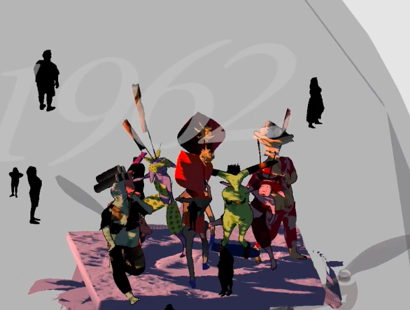
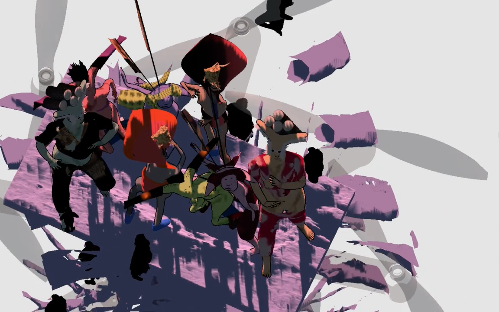
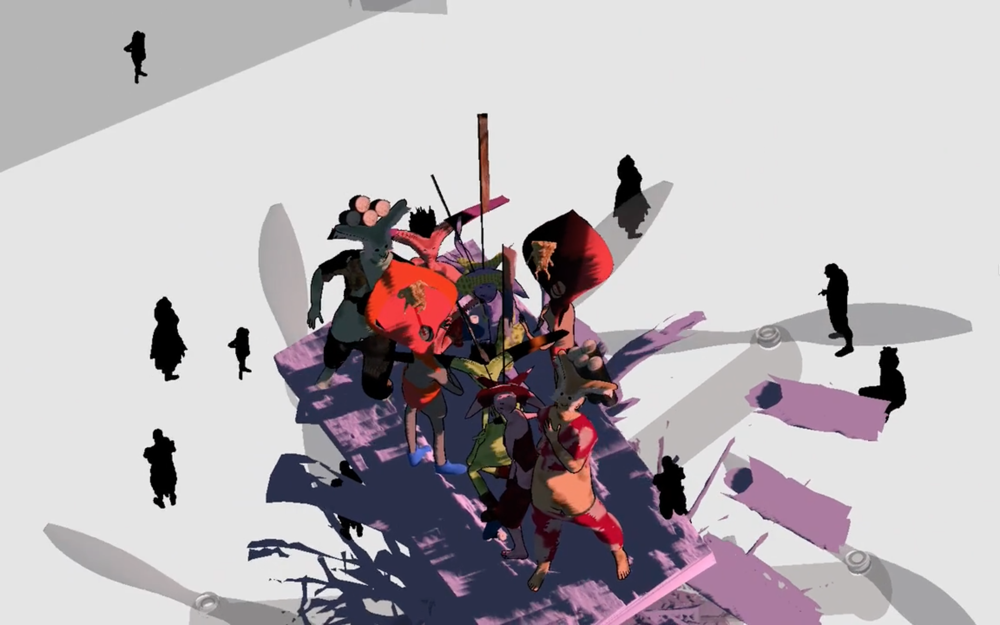
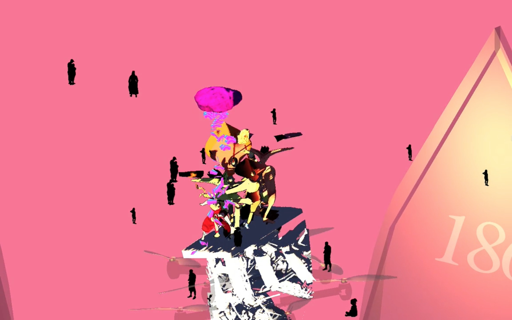
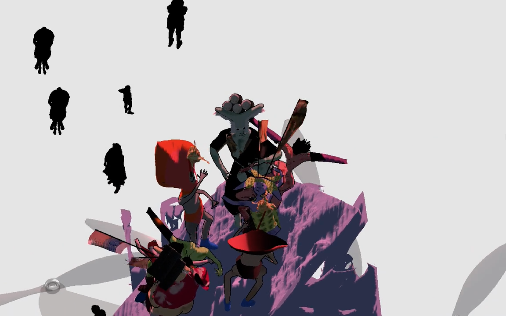
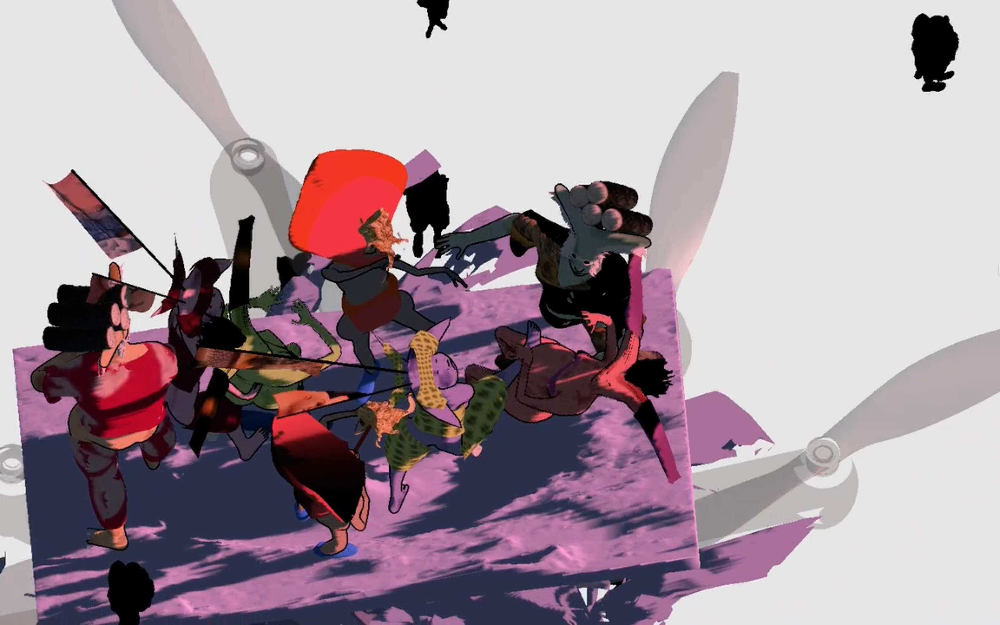
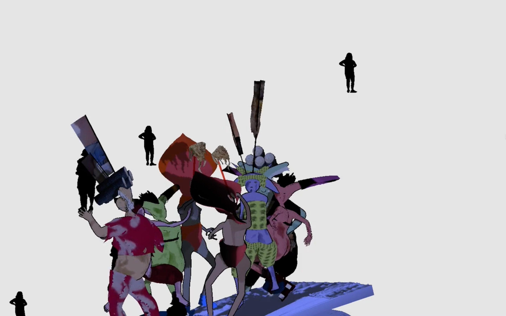

### *Ee Ja Nai Ka*

Miles Hiroo Peyton, 2015

--

*Video excerpt [here](https://vimeo.com/148658177)*

Ee Ja Nai Ka were carnivalesque celebrations that occurred at the end of the Edo period in Japan, from June 1867 to May 1868. Paper talismans fell from the sky and served as a pretext for frenzied dancing and orgiastic behavior. The Ee Ja Nai Ka movement can be read as a form of protest during a tense period of transition on the eve of Japan’s modernization. It stems from a utopian belief in Yonaoshi, or world renewal, which promised improved conditions for peasants living in abject poverty. 

My piece is a live animation that is loosely based on descriptions of the Ee Ja Nai Ka movement from online sources, and from George M. Wilson’s book Patriots and Redeemers in Japan: Motives in the Meiji Restoration. 

The dialogue is taken from Yoel Hoffmann book of poems that Buddhist monks would recite before their death.  

I built the scene in Unity, using assets that I found and made myself. I designed the characters and clothes using MakeHuman, Blender, and Marvelous Designer. The boulder was generated in Photoscan from photos that I took with a DSLR camera. Other objects that appear in the scene were taken from various sources online. A custom shader that relies on Perlin noise creates the effect on the characters’ skin. The movements characters’ movements are derived from motion capture, and are combined with a ragdoll physics system. I use several text-to-speech voices – *Rosie*, *WillSad* and *Micah* – from Acapella to read the poems. 

--

