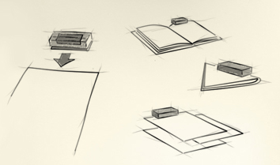
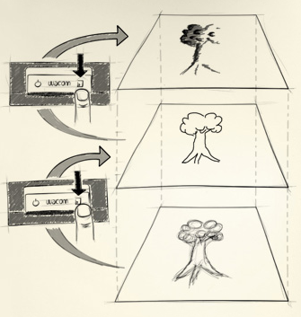

#Wacom Inkling Tutorial
######Note: I’m running Windows 8.1 (64 bit).

#####What is Inkling? It’s a Wacom product that uses infra-red to electronically record your drawings. [Here’s a link to the manual.](http://us.wacom.com/~/media/WTC/Files/Manuals/Current/Inkling%20Manual%20English.pdf/)

##SETUP
###What's in the box?
The Inkling box comes with the drawing pen, a small rechargeable battery that goes into the pen, 4 ink refills, a receiver, a USB cable (like the kind you'd find on a cell phone charger), and case which fits all of the items listed above, in addition to charging the pen and receiver.

###Don't forget to charge! 
It’s always a good idea to check if the device is charged before you use it. To charge, slip the pen into the case, put the pen receiver in its slot, and plug the case via USB cable into a computer or charge block. Make sure the receiver is plugged into the case properly, and that the pen is snugly in its slot.

######Note: The receiver slides into the USB protrusion to charge, so be careful when inserting and removing the receiver from the case.

###Software: Inkling Sketch Manager
Be sure to download Inkling Sketch Manger, which allows you to playback and export drawings captured with the Inkling. Versions for Windows 32 bit, 64 bit, and Mac OS X can be found on Wacom’s site: 

[http://us.wacom.com/en/support/drivers/](http://us.wacom.com/en/support/drivers/)

After installing, you’ll be given the choice to go to the Inkling Tutorial, or the Inkling registration page.
Essentially, choosing either re-directs you to the Inkling website: 

[http://inkling.wacom.com/](http://inkling.wacom.com/)
######Note: As of writing, the above site throws up a 404 if you select “English” under the “Americas” heading. Selecting “English” under “Europe” works just fine, however. 
[http://inkling.wacom.eu/?en](http://inkling.wacom.eu/?en)

##USAGE

###Drawing
To use the Inkling, clip the receiver to the edge of a sheet of paper up to size A4, turn on the receiver, and it will track the pen. Note that, there is a 2 cm zone right below the receiver where it cannot accurately record marks. Additionally, there must be a line of sight between the head of the pen and the receiver for marks to be recorded.

The receiver has two buttons: one for power, and one for layers. Yes, you can create multiple layers in a drawing, just by pressing a button! However, this has a few drawbacks:

- There is no way to cycle between layers.
- Pressing the layer button, more often than not, messes up 
the alignment between the page and the receiver.

###Accuracy (Or Lack of It)
This brings me to the Inkling’s biggest issue: It is incredibly finicky due to the receiver's tendency to shift position, and this results in a lot of frustrating inaccuracy, as demonstrated in the images below. 

#######Left: Drawing made with Inkling pen on paper. Right: Drawing as captured by Inkling receiver.

### Uploading Images
When done drawing, turn off the receiver and connect it to a computer via USB cable. Open Inkling Sketch Manager to view and export drawings. Sketch Manager also has a variety of playback features that allow you to see your sketch come together stroke by stroke.

Wacom has a fairly detailed video about how to use sketch manager: 

[https://www.youtube.com/watch?v=MhvTQWjLw5g](https://www.youtube.com/watch?v=MhvTQWjLw5g)

###File Types
- .wac and .wip appear to be the native Inkling file formats.
- Files can be exported into Photoshop and Illustrator though Sketch Manager. 
- Within Sketch Manager, there is also the option under File => Save as Different Format, which converts to .png, .jpeg, .pdf, .svg, .bmp, and .tiff file types. 

###Online Mode
There’s also an online mode, which allows the Inkling to control your mouse, just like a drawing tablet would. Connect the receiver to your computer via USB, clip it to some paper, turn it on, and you're good to go!

(Unfortunately I have been unable to get this mode to work on my computer, this may be due to a conflict between the Inkling software and other Wacom tablet software installed on my machine.)

###Want More Details?
The [Inkling Website](http://inkling.wacom.eu/?en) and the [Inkling Manual](http://us.wacom.com/~/media/WTC/Files/Manuals/Current/Inkling%20Manual%20English.pdf/) do a good job of covering the tool’s usage in more detail. 

###Want More Reviews?
For additional critical reviews of the Inkling, see
[this article from Macworld](http://www.macworld.com/article/1163787/wacom_inkling_makes_pretty_pictures_but_software_is_sluggish.html) or [this review on DeviantArt](http://viur.deviantart.com/journal/Why-not-to-buy-a-Wacom-Inkling-A-critical-review-257215028).
##The Stumbling Block: Getting Data from the Inkling

Getting data off of the Inkling is a bit beyond my current ability. However, Christopher Baker has a project in-progress about getting pen data from the Inkling.

[https://github.com/bakercp/libdpen/blob/master/docs/ELI_FileSpec.md](https://github.com/bakercp/libdpen/blob/master/docs/ELI_FileSpec.md)

Additionally, Roel Janssen has put together a GNU/Linux version of the Inkling Sketch Manager, which also appears to allow for getting data off of the Inkling (I don’t have a Linux system, so I wasn’t able to test this).

[https://github.com/roelj/inklingreader](https://github.com/roelj/inklingreader)
