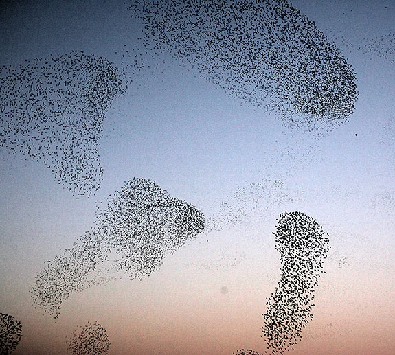

# Looking Outwards 03: STARFLAG - Understanding Starling Flocks

###STARFLAG, 2005-2008

[Website Link: STARFLAG - a project on collective animal behaviour](http://www.sapienza.isc.cnr.it/Biological%20Systems/Flocking/STARFLAG:%20a%20project%20on%20collective%20animal%20behaviour.html)

The starling is a small iridescent bird of European origin that is known for flocking in large groups, called "murmurations." The structure of this gathering of birds was a long-time mystery of animal behavior, one that STARFLAG aimed to solve by bringing together scientists from a wide variety of disciplines. 

Because of how many individuals comprise a starling flock, it seemed nearly impossible to track each bird. Enter stereometrey. By taking two snychronious pictures of the flock from different angles, stereometric pairs of photos were created, and analyzed to obtain 3D positioning data for each individual bird within a flock of thousands. 

###The Magical Number Seven, Plus or Minus Two: Some Limits on our Capacity for Processing Information, 1956
[Article Link: The Magical Number Seven, Plus or Minus Two](http://psychclassics.yorku.ca/Miller/)

The most interesting finding from STARFLAG was that each starling only keeps track of its seven closets neighbors with regards to how it positions itself in the flock. This "rule of sevens" limit for processing objects has been previously observed in humans by George A Miller, one of the founders of cognitive psychology.

I think STARFLAG is a great example of how technology can help us understand the behaviors in the organisms around us. Birds, which often move too quickly for the human eye to appreciate, are a prefect subject to take advantage of the acuity of computer vision. 

While I understand that STARFLAG was a research-focused project, I would like to see the data used to create an aesthetically appealing visualization that better highlights the "rule of sevens" in effect.