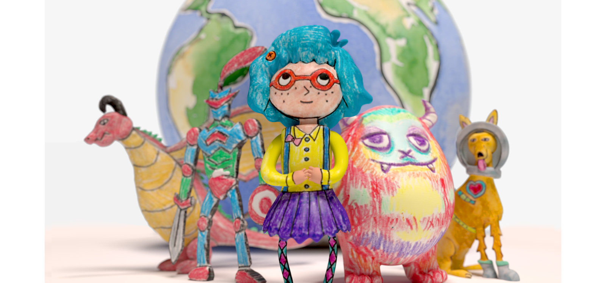
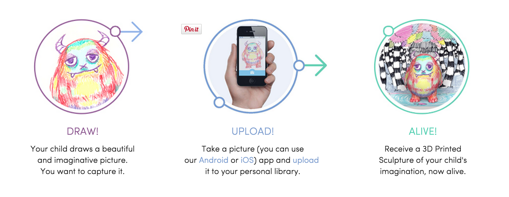

#Kids Creation Station

--

  

###Overview
Kid’s creation is a new startup that lets parents upload their child’s drawing onto an online application where they
will then receive a digital 3D model of their child’s creation. They  have the option of ordering the model as a 
color 3D print for $100. It’s simple and cute. 

[Kids Creation Station Site] (https://kidscreationstation.com/home)

 

[Helpful Article explaining process] (http://3dprintingindustry.com/2014/11/27/kids-creation-station-3d-printing/)

###Why it’s Exciting!
Even though this is sort of a corporate project I find the entire idea and premise of the service quite meaningful. It’s a 
sort of art project of sorts. When I hear of this project I think back to my own kindergarten days when I would scribble 
away on paper. If this service was available to me then, I think I would have been blown away to see my character as a 3D 
model. It’s sort of like bring a child’s inner world into the real world which is interesting considering most children 
don’t dwell on the limitations of the real world when drawing. The objects themselves also look compelling and I find 
myself wishing it were in an art context because the objects would look very beautiful in a museum space.

Finally, it’s pretty amazing that 3D printing is beginning to make it into a sort of mainstream business context. Other 
companies I’ve seen that mainly do 3D printing for their products don’t see as universally pertinent. They seem like businesses 
you would know about because you are interesting in 3D printing or need a spare piece of something 3D printed. This service, 
on the other hand, is one that I can imagine anyone would enjoy.

###Why it’s not as Exciting…

This project has a potential to do a lot more things -  they could animate the creatures, for one. Also, it seems like it has 
a sort momentum and then stops when the only thing you can really do with your model is have a 3D file or order a print. 
Hopefully, as time goes on and as they judge their market segment, they will add a lot more supplementary thing your can 
so with the creatures. Perhaps import them to a game? Use them as an avatar? Use them in a set of predefined animations? 
I think the project just has a lot of room for growth.

