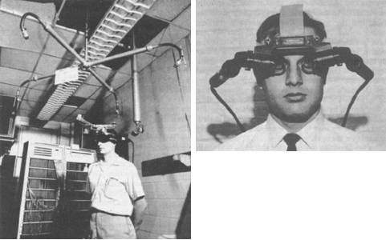

## Looking Outwards #1: *Phantom (kingdom of all the animals and all the beasts is my name)* by Daniel Steegmann Mangrané (2015)

This installation allows the participant to visually immerse himself in a three-dimensional representation of an actual rainforest in Brazil. A section of rainforest was scanned in three dimensions (using a ScanLab laser scanner) and rendered. The representation is experienced using an Oculus Rift headset that is tracked in the installation space using OptiTrack motion capture cameras. The rainforest appears as polygons and points of light in black and white. Viewers can walk around the room, which will translate appropriately to movement around the rainforest rendering. The technology of the project is interesting me – there is capture involved both in scanning the forest as well as in tracking the viewer. I am also intrigued by the prospect of virtually experiencing real places. Fully convincing simulations still seem distant, however. Mangrané successfully avoids this problem by using a somewhat abstract rendering, and using the abstraction to evoke questions about the relationship of things and ideas. Mangrané’s choice of a fragile rainforest area seems very appropriate for this type of transportive affair. Text, photography, and videos do the project some justice, but one can imagine that the effect of being about to fluidly move through the space in person would be fairly awe-inducing. Any ability to remove distraction would enhance the space, though, and the goggles and head tracking rig (with its large “Oculus Rift” logo) is fairly awkward looking. Phantom hearkens back to the very beginnings of virtual reality, when Ivan Sutherland and Bob Sproull created their heavy, head mounted VR system The Sword of Damocles. It, too, was suspended from the ceiling and, limited by the technology of 1968, used polygons in place of convincing realism.  

---

  

---

  
*Sword of Damocles*, "First head mounted VR" (1968)

## Sources
[http://www.danielsteegmann.info/works/41/index.html](http://www.danielsteegmann.info/works/41/index.html)  
[https://vimeo.com/119324295](https://vimeo.com/119324295)  
[https://en.wikipedia.org/wiki/The_Sword_of_Damocles_(virtual_reality)](https://en.wikipedia.org/wiki/The\_Sword\_of\_Damocles\_(virtual\_reality))
