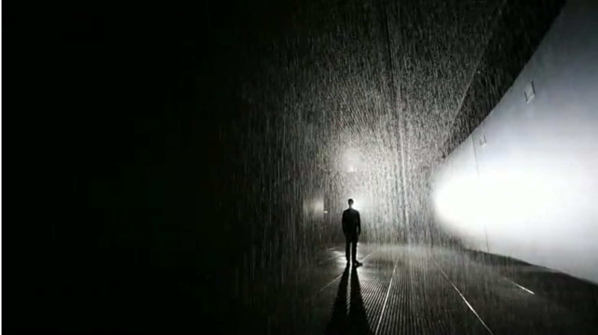

## Looking Outwards #2: *Rain Room* by Random International (2012)

*Rain Room* is a very popular interactive installation designed by Random International. The artists created an indoor rainstorm that the visitor can walk through (slowly) without getting wet. The effect is created by precisely controlling the overhead water outlets such that the ones directly over the viewer are momentarily disabled wherever they are in the exhibit. This is made possible using 3D tracking cameras and custom software, which determines the position (and perhaps trajectory) of the viewer and translates that into commands to a multitude of solenoid valves. The popularity of the piece is easy to understand – having it rain around you but not on you is impressive. I have not had the opportunity to experience the exhibit first-hand, but others have described the effect as inducing a feeling of great power over the environment. There is something interesting about the level of trust the viewer must have to step into the installation – they are relying on the artists and the hardware to keep them dry. Even knowing that thousands have experienced the piece, I can imagine taking the first few steps tentatively. Once the installation 'proved' itself, though, it would be hard to resist the temptation to run around and delight in the feeling of one's newfound magical ability. Similar projects have appeared in the past. Perhaps the most familiar was designed by MIT's Media Lab (working with a number of contributors) and involved the creation of a "Digital Water Pavillion" in 2008 for the World Expo in Spain. In this project, precisely controlled jets could "print" messages in a curtain of water surrounding the pavillion. Notably, the curtain could also open up (i.e., the water would stop falling at that specific point) as visitors walked up to it, allowing them to pass through without getting wet. Similar to *Rain Room*, the effect of having power over the equipment must have been memorable. On the other hand, *Rain Room* abstracts the sensation a bit farther to suggest that the visitor is not merely controlling a series of solenoids but rather nature itself. The dark, humid environment of *Rain Room* lends itself to this. Perhaps by disguising the equipment itself or elevating the water jets higher, the effect might be further amplified.

---

  
Rain Room (2012)  
*source: https://vimeo.com/51830893*

  
Rain Room (2012)  
*source: https://vimeo.com/51830893*

---

  
MIT's Digital Water Pavillion (2008)  
*source: http://sap.mit.edu/article/standard/building-made-water*

  
MIT's Digital Water Pavillion (2008)  
*source: http://sap.mit.edu/article/standard/building-made-water*  

---

## Sources
- [http://random-international.com/work/rainroom/](http://random-international.com/work/rainroom/)  
- [https://vimeo.com/51830893](https://vimeo.com/51830893)
- [https://www.moma.org/visit/calendar/exhibitions/1380](https://www.moma.org/visit/calendar/exhibitions/1380)
- [https://fr.wikipedia.org/wiki/RAndom_International](https://fr.wikipedia.org/wiki/RAndom_International) ([Translated](https://translate.google.com/translate?hl=en&sl=auto&tl=en&u=https%3A%2F%2Ffr.wikipedia.org%2Fwiki%2FRAndom_International))
- MIT (et. al.) Digital Water Pavillion [https://vimeo.com/87276837](https://vimeo.com/87276837)
- [http://news.mit.edu/2008/zaragoza-tt0611](http://news.mit.edu/2008/zaragoza-tt0611)
