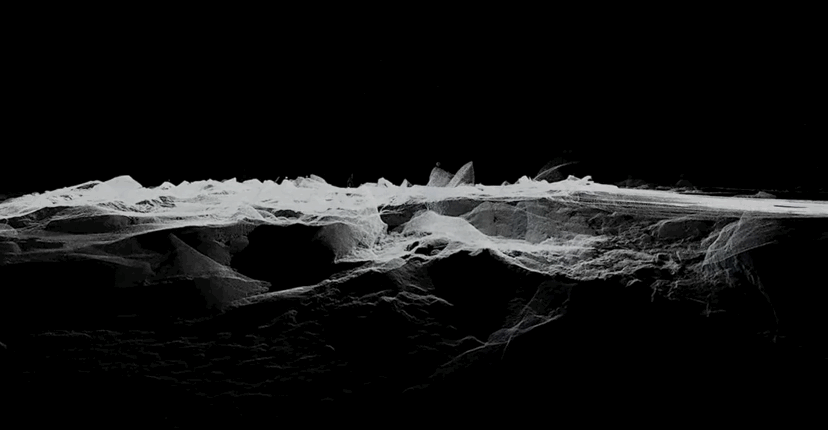

## Looking Outwards #6: *Frozen Relic: Arctic Works* by ScanLAB (2013)

*Frozen Relic: Arctic Works* is a ScanLAB work created under commission. The work consists of a darkened room containing large slabs of frozen saltwater moulded into the shape of actual arctic Ice Floes. They are elevated above drip trays that serve as moulds for the original shape. Visitors to the exhibit hear the dripping of the ice, and over the course of several days, the ice melts completely into the trays. It is then refrozen and resuspended.

The artists performed precise 3D scans of the ice floes from above and matched them with underwater sonar scans. 3D digital models were constructed and then used to create the moulds (employing CNC milling machines).

One might expect the representation of the 3D scanned top surface to be the most compelling part of the work – but in fact, that part of the ice sculpture freezes flat in the mould. Compared to the rich and interesting shape of the bottom, the top does look a bit mechanical and jarring. This is concealed by elevating the ice. The work is likely most effective in content and aesthetics when it is partially melted, however. It would be interesting to a fully 3D scale ice floe, though. Of course, most of the ice floe is underwater – so perhaps this is appropriate. The frame that supports the ice is shaped in such a way that you can see the full 3D form of the ice, top and bottom.

The content references the state of arctic ice in the context of arctic oil exploration and drilling. It was produced with the involvement of Greenpeace.

The piece was displayed in the Architectural Association Gallery in London in 2013.

---

  
*Frozen Relic: Arctic Works*   
Source: [https://vimeo.com/65902863](https://vimeo.com/65902863)

  
*Frozen Relic: Arctic Works*   
Source: [http://scanlabprojects.co.uk/projects/frozenrelic](http://scanlabprojects.co.uk/projects/frozenrelic) 

---

## Sources
- [Exhibit description from ScanLAB](http://scanlabprojects.co.uk/projects/frozenrelic)
- [Video (Vimeo)](https://vimeo.com/65902863)
- [Exhibition Poster](http://scanlabprojects.co.uk/assets/AA_Exhibition_Guide_ScanLAB_Projects.pdf)