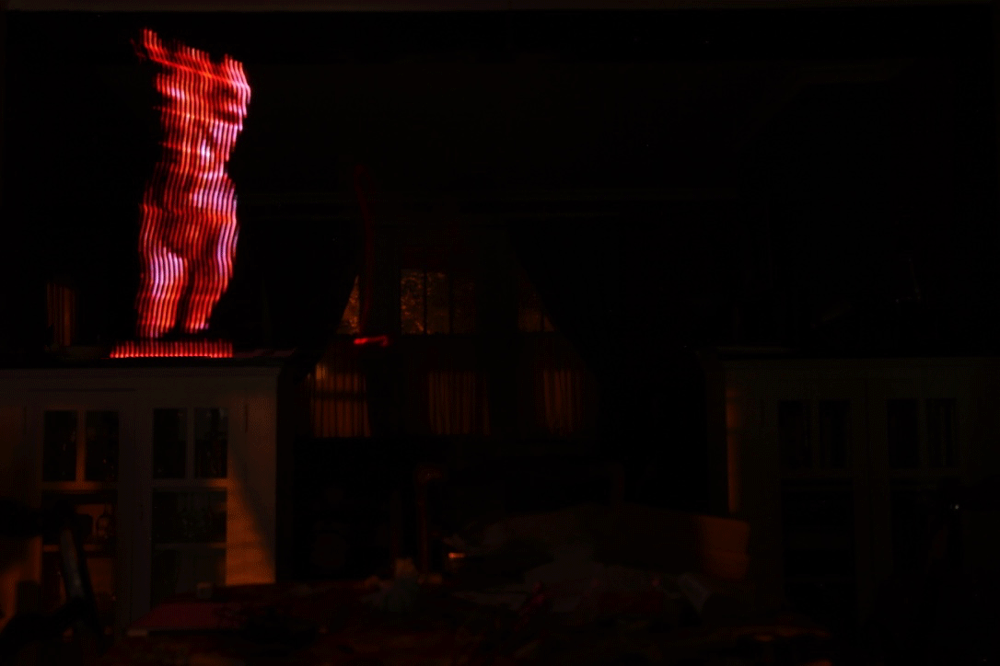
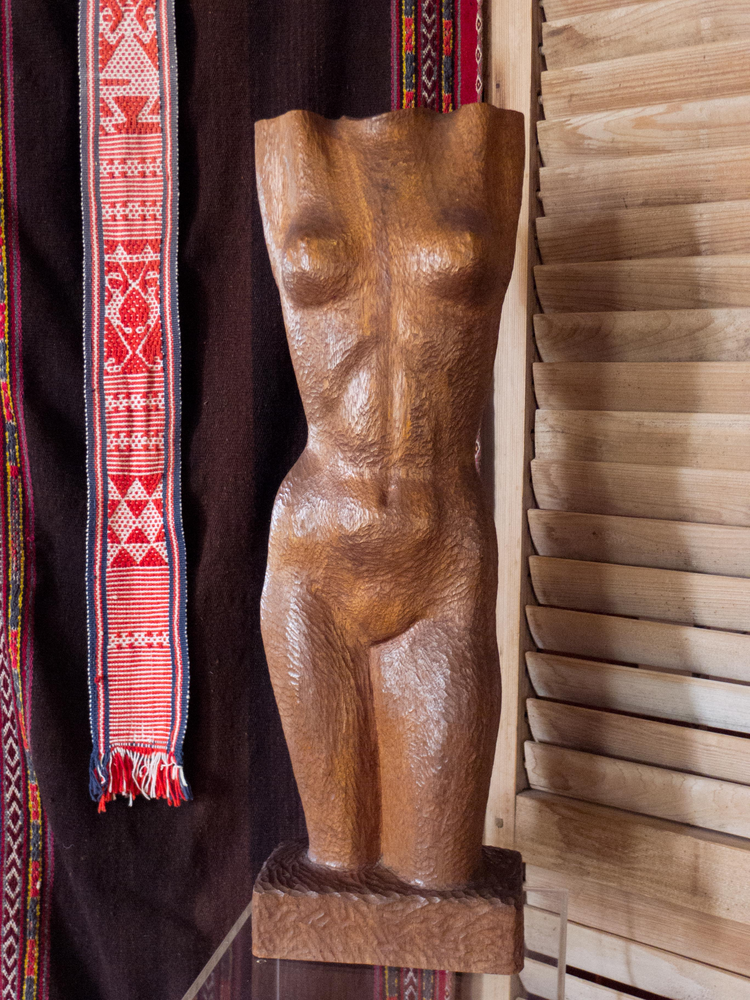
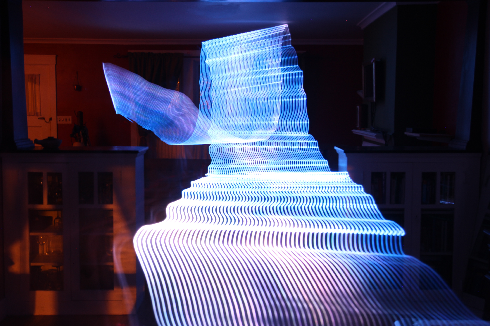

## Project #1: Maiden

This project explores a sentimental item that is captured in its home but then depicted out of place, and 'captured' again. The subject of the piece is a wooden sculpture of the torso of a woman, entitled 'Maiden'. The sculpture was created by my great-grandmother, Rainold Murray. Asides from the ancestral significance, the sculpture also is intimately attached to a significant place – it sits on a pedestal in my grandmother's home 600 miles away.

The image of 'Maiden' is now several times removed from the original subject. First to wood, then to photograph, and finally to a light painting captured in a second photograph at an entirely new location (where it is literally 'out of place').

### Process

I was intrigued by the idea of capturing the superimposed image of objects onto the real world. To accomplish this, I built a light painting device. The device consists of a 60 pixel RGB LED strip and a Raspberry Pi, with various electronics to make them play nice. The software is a modified version of the Python light painting script by Adafruit. It relies on a library created by Jeremy Garff (with other contributions). The software takes images, reads RGB informtion pixel column by column, corrects for gamma, and displays each column in sequence. The final 'image of an image' (of an image) was captured using a DSLR with long exposure.

### Successes and failures

There are aspects of the final images that I think were successful. The object feels 'out of place'. The light painting rig rendered the object with the level of fidelity (and abstraction) that I had hoped for. I like the gestural quality. Furthermore, the process was extremely informative. I threw myself into the deep end a little bit. I have never light painted before. I have no experience working with Raspberry Pi, and virtually no experience working with hardware projects. This was made particularly challenging, because no tutorial addresses running this particular rig off of batteries, or on the most recent iteration of Raspberry Pi. Furthermore, I have no training in photography.

I do like a challenge, though. And, each of those areas was one I really wanted to explore.

Where the project did not succeed as well as hoped was primarily due to areas where more expertise and time were needed to master the skills. After countless repetitions, very few images were even remotely usable. My most obvious issues are inconsistent speed, too-obvious individual LED 'stripes', and finding the proper light balance to capture the background and the subject.

### Other ideas

I built the light painting stick with a Raspberry Pi brain, which is a completely unnecessary amount of overhead for this project (an Arduino would have been far simpler.) However, the memory, processing power, and number of inputs and outputs mean it has a lot of potential for doing light paintings that just wouldn't be possible with other means. I would like to explore light painting 'live' images broadcast from elsewhere. I am also intrigued by data visualizations superimposed over their subject.

---

*Maiden*

 
*It's impossible (without hardware augmentation) to repeat the light painting precisely each time, so each image is unique.*

*Maiden x4*

---

 
*Maiden, by Rainold Murrray x4*

---
  
*Light painting rig, with internals exposed*

  
*Test of light painting rig*

### Acknowledgements

Adafruit's tutorials on interfacing the Raspberry Pi with the RGB LED strip were invaluable.