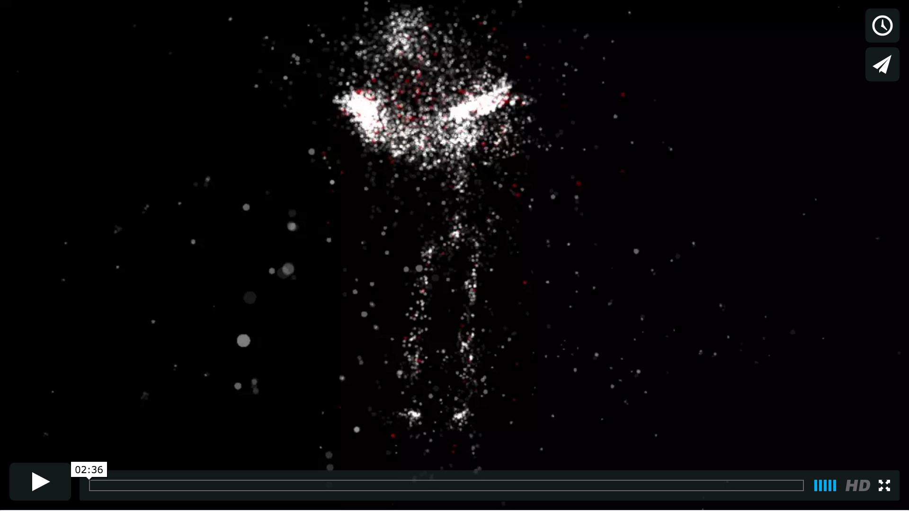

## Project #2: Conduction

Conduction is an executable visualization of a conductor directing Orff's 'Fortune plango vulnera' from Carmina Burana. The piece is ultimately a portrait of the conductor, in this case a close friend, who makes an emotional investment in the work. This movement in this piece references the energy of the process, but also the transfer of the energy from the conductor to the performers.

The final output is an executable in which you observer (and can rotate in 3-D space) the conductor as he directs the piece. The motion data is portrayed by particle generation at select bones and joints. Red particles are generated at each actual heartbeat. The size of the particles is determined by sampling (and then smoothing) the intensity of the audio at each update. The closeness of the camera to the conductor is determined by the electrodermal activity.

### Process

A close friend and conductor was interviewed about musical pieces that he tended to get particularly emotionally involved in. He suggested Carmina Burana. I built an Arduino based bio-data logger that strapped to his upper arm and captured heartbeat (using a photoplethysmography sensor) and his electrodermal activity. I then performed a motion capture of him conducting the piece with the bio-data logger using the OptiTrack system and 49 retroreflective markers. 

The raw data consisted of .bvh motion data from the OptiTrack, and a CSV of bio values from the logger. The bvh was processed and cleaned up in Blender. OpenFrameworks is used to generate the final executable.

### Successes, failures, and opportunities

The piece successfully captured the energy of the performer, and it seems to be a relevant and interesting use of the biological data. It would be interesting to spend more time tweaking how the data influences the visuals – for example, the electrodermal response may work better with smoothing and further scaling. Additionally, it would be interesting to play with other data sources – the direction the conductor is looking, the intensity of particular frequencies in the piece, etc.

### Acknowledgements

Special thanks to Kelly Burns.

Music: Orff's 'Fortune plango vulnera' from Carmina Burana performed by the Atlanta Symphony Orchestra & Donald Runnicles (2002).

OfxBvh and particle generation sample code from https://github.com/perfume-dev