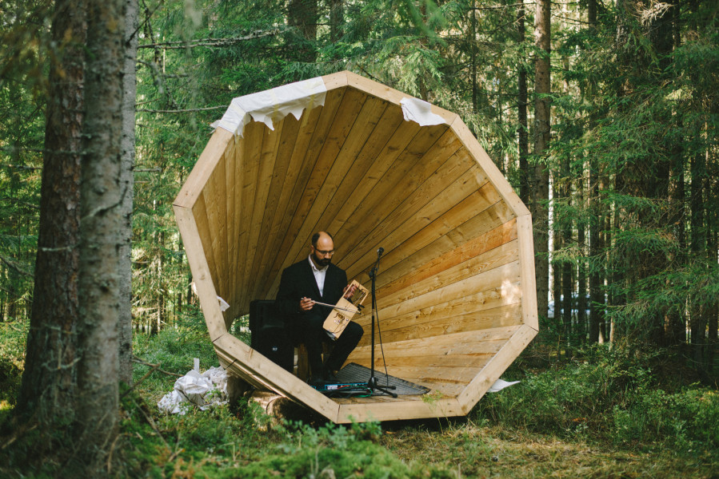

# Giant Megaphones that Amplify the forrest

I lvoe this project because it is so incredibly analog. The three giant wooden sculptures will merge and mesh the sound in an interesting way in the area between them. This area will be used to hold events, but can also just be used for camping. One can acoustically inhabit a far greater section of the forrest than without these megaphones. I would love to hang out and play with them for a while. With no fancy-schmancy hardware, the students of the Estonian Acadamy of Arts have managed to not only transform a place, but to challenge the way inhabitants think about their relationships to the world around them.

