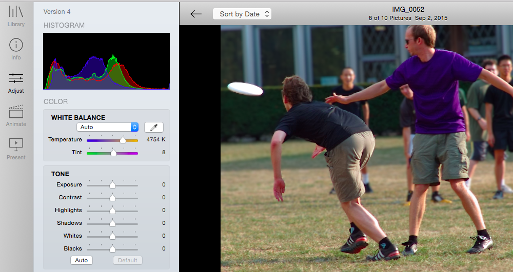
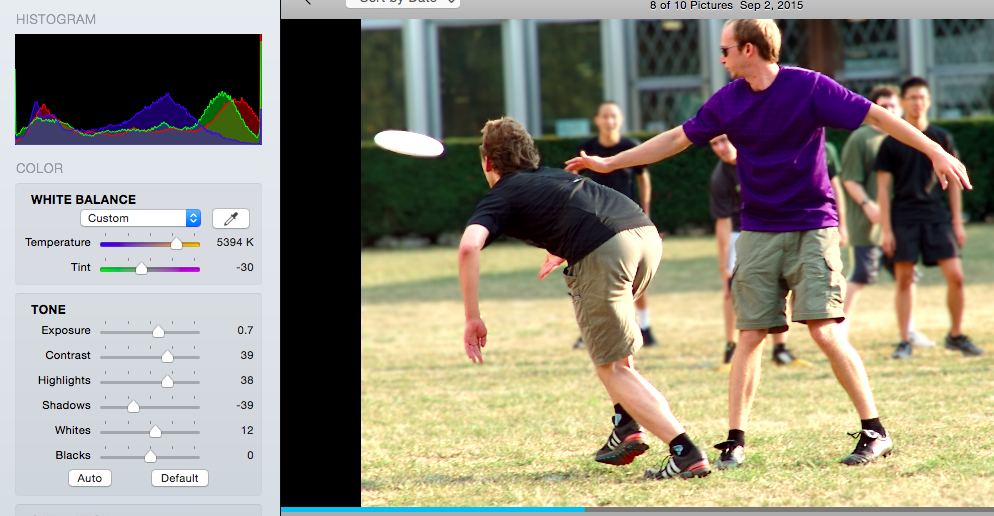
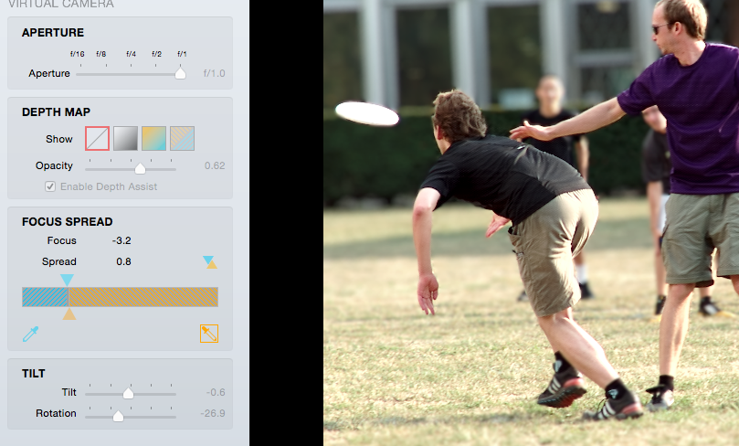
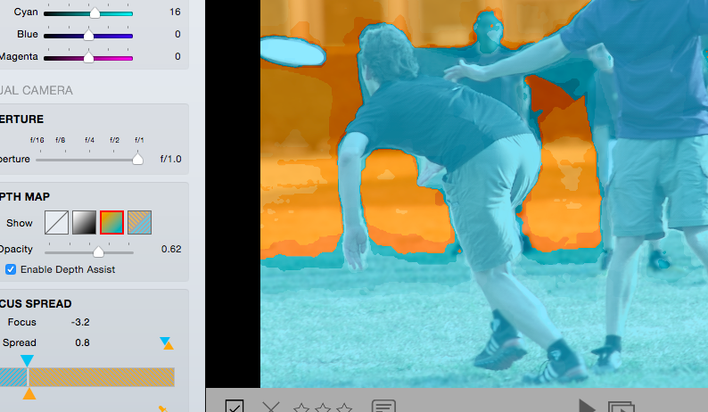

# The Lytro Ilum - Getting Connected

## Using the camera. 

The Lytro is a lightfield camera, and is very unique. The camera doesn’t take regular photos (RAW or JPG), but lightfield images. These images, in Lytro’s “.lfp” format can be converted to jpeg’s, raw’s, and more - such an animated movie files or interactive files.

The images’s have the unique ability to adjust the focal plane, the depth, the aperture, and more in post production. 

Read about the controls and using the camera [here](http://manuals.lytro.com/illum/capture-mode/) and watch educational viduos that Lytro produced [here](https://lytro.com/learn/).

## Importing images with Lytro software

The trouble with the Lytro is that you are pretty much trapped inside the Lytro universe, since the file is so unique.

Download the [Lytro Desktop Viewer](https://lytro.com/desktop/).  This software will detect when you connect you camera and prompt you to transfer the images.

I recommend that you transfer, delete the files from the computer after the transfer (we are sharing an SD card here), but don’t process the files immediately.

Lytro needs to process the files in order to edit, export, and so on and so forth. This program brought my Macbook air to it’s knees, crippling it. (Hey, The Ideate Lending library has macBook Pro’s we, in the ExCap class, can borrow!). Go through your photos and flag the good ones (“flagged”, keyboard shortcut is “f”). Also, reject (“x”) the bad ones). Then, go over to the flagged photos, select all, and hit process. Then, if your laptop is sad like mine, go grab a snack. Go outside. Think about your feelings.

## Importing images with 3rd party hacked software.

Lytro will, eventually, release an [SDK](https://support.lytro.com/hc/en-us/articles/200863200-What-are-your-plans-for-open-development-). This hasn’t happened yet. But don’t worry, there us hope! There is been a lot of headway into hacking open the Lytro camera and file format. Most of this research is centered around [this webpage](http://optics.miloush.net/lytro/), which contains a [library](http://optics.miloush.net/lytro/TheViewer.aspx), as well as lots of glorious technical information about the file format.

## Editing for Static Images

Once an image is processed, it’s time to edit.

The left menu bar has a few options: Library, Info, Adjust, ANimate, and Present. Library and Adjust are all we care about for editing the images. The library is for organizing all of our lightfield images, the adjust menu where we can make edits.

*Note: Transitioning from Adobe Lightroom to the Lytro Desktop software is horribly frustrating. If you, like me, live in lightroom, you have my sympathy. This software is hiddeously underpowered.*

The camera has a nasty trouble with it's highlights - it tends to blow them out rather quickly. The exposure calibration on auto, thus, shoots for the shadows, and everything often looks a bit underexposed. Further, it - like many digital cameras - tends to keep anything from the whites and the blacks, giving a rather gray tonaly, drab, boring, unexciting, and lame image. These are technical terms.

We can see in the RGB histogram that the right 1/4 (whites and highlights) is empty, and the left edge (blacks and shadows) has a friendly buffer, confirming my beliefs about the auto-exposure algorithms.

Every Lytro image I have edited so far, I've started with the same basics. I bring up the exposure a hair, the  highlights (slide right), I slide up the contrast a tad, and drop my shadows and blacks to taste.

The auto-white balance also has some troubles that could use manual tweaking. I warmed up this image. It is summer, after all. The defualt white balance - and the color conversion from RAW in general, has been doing ugly pink things to skin tones. Desaturating the red channel may also help.

.

*This image is still a bit overexposed and the highlights are too high, but it's a starting point for further images. The same starting point I've used on most Lytro images, which is why I talk about it here.*

## Editing The Virtual Camera (AKA cool focus shit)

The virtual camera section of the editing menu is full of adjustments that, without a lightfield camera, would need to be done in-camera by a highly experienced photographer (ahem). 

The aperture control - the one we were so confusingly missing on the camera itself - has finally made it's appearance. Note, the lens has a natural aperture at f/2. We care about this because of intensity of light must be adjusted with the shutter speed. In post, adjusting the apterture will not affect the intensity of the light - only the depth of field.

f/16 is high, although most cameras can go higher. While this is a curious limitation on the depth of field for the camera, f/16 is still a plenty high aperture for large depth of field in most cases.

Where things get fun, however, is the shallow depth of field. Clicking on the image will set the optical (ie: perfect/natural/regular-camera) focus to that point. Set the aperture somewhere between f/4 and f/1. f/1 is an rediculously shallow depth of field, and the silk blurry background will appease many eyes.

The Depth Map is only a visualization - it doesn't change anything in the image. Turn it on by clicking the orange/blue square. Everything closer to the camera than the focus point is blue, and everything farther is orange. The focus point is, yes, a point (well, a plane). Everything will be either orange or blue with the depth map, even if it is "in focus".

The focus spread will be your bread and butter. The sliders are a pain, I recommend the eyedropper tools. Click the blue eyedropper, and select a point (for me, the grass in front of the closer players foot) that will be the closes point to the camera in focus. (All closer is blurry). The orange tool is the same, but all farther points will be out of focus. I selected a point just behind the second players feet, on the grass. Now my two frisbee players are in focus.

In my opinion, one of the coolest parts of the Lytro camera is the ability to do tilt effects in post. Normally such effects require a large format camera or an expensive "tilt/shift" lens. Lytro gives you two sliders, tilt and rotation. I highly recommend experimenting with these sliders. 

## Exporting Images

To export your images, click file > export... with the image selected.

Pay attention to the file format dropdown box at the bottom of this window. You can choose .png or .tif of 'refocused image' is Lytro-speak for a regular old boring image.

Then, static 3D images are neat. The red-cyan one is classic 3D with silly glasses, and the full color 3D one can be displayed on 3D TV's. 

The Lenticular print is a series of static images all from a slightly different perspective. I took these images into photoshop, as layers, then exported an animated gif image. *(Window>timeline to set up the animation. Then duplicating the layers and using layer>arrange>reverse to reverse the animation.)*

.

Lytro Camera Raw is a copy of the raw file.

To export a 'living picture' that you can click on, you need to upload the image to Lytro's web gallery, then copy an HTML embed code. This requires a Lytro account. Lame. Here is an example of that, since I don't want to create a lytro account. (Note, you can also upload to facenbook and 500px). Both of which will support the 'living picture', where you can click and refocus.

<iframe width='600' height='434' src='https://pictures.lytro.com/CharlesMaring/pictures/1041682/embed' frameborder='0' allowfullscreen scrolling='no'></iframe>

## Externally Editing Living Pictures (thank god)
One can export an 'editable living picture', which is a folder of multiple images from different 3D perspectives. One can select and edit all of these changes in, say, Adobe Photshop. Lightroom can edit multiple photos at the same time (create a preset, or copy/paste edits from the right click dialogue.)

You can, once the edits are complete, re-import them into lightroom. (File>import from folder, click the stack.lfp file).

## Example Images I took

