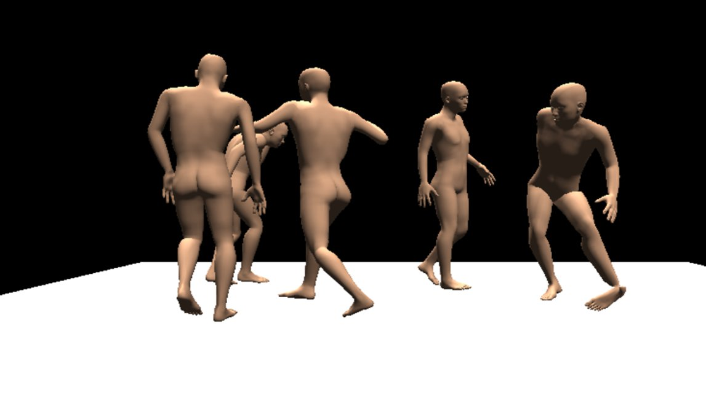

# MoCap Canon

In this project, Akiva and Smokey created a looping temporaly delayed 3D choreography in the spirit of Norman Mclaren's [Canon](https://www.youtube.com/watch?v=2VrnXw9waJI). We repeated a precise motion captured set of movements and applied the same animation to multiple figures that follow/echo each other. Foley sound effects were also incorporated.

The final product is an executable where one can observe the animation and 'fly around'. Watch a video of the project above.

Click [here](build/Canon.exe) to download the windows executable, and [here](build/Canon.app) for mac. View our various source files [here](/source/).

The motion capture data is astounding in it's "human-ness". Even a very abstract figure, with such accurate human movement - becomes a relatable character. Akiva and I both learned an immense amount all accross the workflow of 

# Future Steps

Bringing the Unity executable to virtual reality is the next most concrete step. We also would love to just play with this form more. More complicated choreography with interlacing 'beats' - perhaps involving external objects being picked up, placed down, ducked under, and so on, would be appreciated. 

Next, recording the audio during the capture period (including having a choreography with audio worth recording) would, ultimetly, save a lot of time.

In the future, we would like to be able to create this dance 'live', using the Optitrack's system of transmitting live capture data over networks. This would make the choreography process much easier and more enjoyable. We began work on a unity app to recieve and display the skeleton data live. While we were able to create a live camera view on a simple rigidbody, sending and understanding the full skeleton data proved to be slightly *too* uncharted of territory. We would like to return to this challenge in the future.

Read on for a more detailed discussion of the challenges we faced, and how we solved them.

# Challenges 

## Choreography
Choreography ended up not being our primary challenge - but this was because we did not test our limits with the complexity of the piece. Facing technical issues on other fronts, we went with simpler movements and compositions, planning to work on more complicated 'dances' after our workflow was nailed down. 

To choreograph the loops, one has to pay lots of attention during the planning phase. We created audio files full of precisely timed instructions that the actor could listen to while performing. 

## Capture
The first major challenge was during the recording process. In addition to all of the regular trickiness of motion capture - the dots, the cameras, the calibration, oh my! - we faced an odd and unrepetable issue where an entire day of progress had not been saved. 

It seems that the Optictrack Motive software saves 'takes' (recordings) independent of the project file, which holds references to takes, skeletons, calibration data, and more. This is probably because the takes can potentially be very large in size. We lost our data when our takes got disconnected from our project. Possibly, they were deleted while some other user was cleaning up - various technically adept searches for the data were unfruitful (yes, we checked the recyling bin).

## Exporting
One has to follow a specific set of steps when exporting data from OptiTrack - ensuring the appropriate skeleton is selected, and the approriate options in the export dialogue are selected. Maya enjoys Binary FBX files the most, while Blender plays well with BVH. Cinema4D also works with both FBX and BVH.

We encountered an issue where none of our transformations got exported with our data. This could be because the skeleton was not selected, or because we lost the take session files, or some other reason. We don't know. The end result was large files full of zero's. We spent many hours trying to troubleshoot software not loading animations, when the real problem was our animation file. **It's worthwhile to doublecheck exported tracking data.**

## Mesh	
We used HumanMaker to create a rigged mesh automatically for us. (We also followed the same steps in Maya, which was far more difficult, particularly as we had to, well, learn Maya. Maya's HumanIK system is adept at working between various animations and rigged output mesh's, but one has to be already in this system to benefit from it's features. The Motion Capture data and HumanMaker use slightly different skeleton arrangments, which never would be defined well in the HumanIK system.

We managed to solve many of our problems with Blender, although it is worth noting that Cinema4D seems capable of being very friendly with mocap data.

## Looping
The timing of the final animation and the timing of the audio files were not precisely the same. This was due to our actor not quite hititng the mark. We had to precisely nudge the timing between our two interactions (kick and punch) in order to create a visually satisfying result. 

## Audio
Foley sound effects were recorded. The different effects were recorded in different rooms with various noise. Noise reduction processes were utilized, which created awkward hallow sounds. A simple high-pass filter helped dampen the hallow echo, but all of the files were out through a parametric equalizer and a subtle studio reverb in order to help concrete the seperate recordings as being from the same room.

A render of the final animation with a single actor was brought into Adobe Audition, where we syncronized the source inputs with the video - footsteps and impact noises. The punch noise was a layered combination of multiple impact recordings. We split this up and put some of it on the punch, and some on the getting-punched parts of the video, which will help the audio build up and die down as the scene begins and ends.

The audio file was attached as audio objects to each actor. As one flies around the final executable, Unity spacializes the seperate sound files, which really helps sell the environment thanks to the magic of stereo.

## Packaging

Unity provides a friendly interface for working with the data. While we hit a lot of trouble, this was more of our inexperience with the platform than tricky details of using the blender exports or incorporating syncing audio. We worked with unity with the hope of bringing this to a VR experience. 