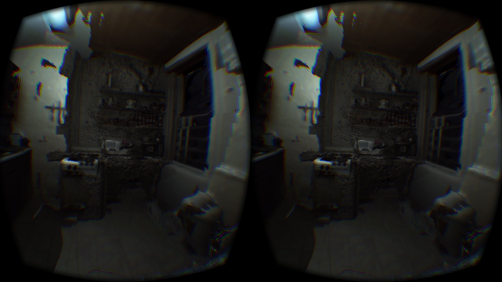
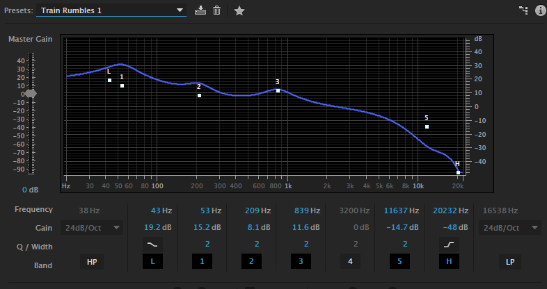

# Any Given Tuesday Night

In this project, Ryan and Smokey created a the experience in sitting in Smokey’s kitchen, which is situated rather close to a railroad.

The final product is an executable where, in VR space, one can experience the atmosphere and the mood of the dingy kitchen, creatively exaggerated in it’s digital form.

# Haptic Feedback
More than just VR, the project also included the use of a 50watt ‘bass shaker’, a transducer that - attached to the chair the user is sitting in - vibrates and shakes along with the train’s out-of-sight rumbles and screeches. The effect, when subtle, solidifies the user in the environment. When the bass shake is pushed to more extreme levels, the effect is that of a wary uneasiness. Many test users reported fear as to what were to happen next.

# Storytelling Futures
The goal in this project was to create something that was more poetry than demo. 

If VR is going to be a future platform for storytelling, we are going to start needing to translate cinematic and storytelling conventions into this new space. In this regard, we wanted to do scene, atmosphere, and mood establishment - not plot. 

# Binaural Audio Capture of a train

The audio was captured with Binaural microphones. The strange rubber ears on these microphones transform the audio signal in the same way that the human skull does, creating a very convincing illusion of being in a place.

In post processing, we brought down jarring high pitch squeals (some), and amplified the bass frequencies that get transmitted to the transducer.

# 3D Scanning
2 different 3D scene capture methods, one with the iSense depth sensor, and the other with a complicated and extensive photogrammetry rig, were combined to create the space. The stitches and texture glitches between these spaces ended up being a happy accident, much of the errors appear like stains or molds, and the imperfection of the model seems to represent an imperfection of the space - exactly what we were trying to capture.

Smokey: Although, I would like to note, that my kitchen is not *that* bad. 

From the beginning we knew we wanted to use photogrammetry’s strange bumpy artifacts to represent the scene. The distortions allow a clearly recognizable scene to possess both a clearly digital/nonhuman author, and a authored/intentional representation, which is unnerving.
