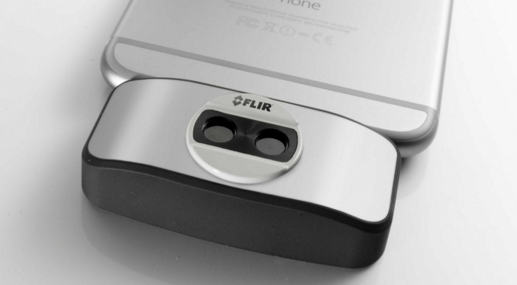

##Thermal Photography and Imaging

**Goal:** To experiment with the FLIR thermal camera in various sights downtown and adjust different filters depending on the heat sensitivity levels.

[https://vimeo.com/148309758](https://vimeo.com/148309758)

The thermal camera is a pretty awesome tool, it's pretty neat that reflections can be seen so clearly on plain glass. I took a lot of footage of me walking around campus and it's cool to see blobs of heat everywhere (students). If I had more time I would have loved to capture reflection of the city on the sea.

