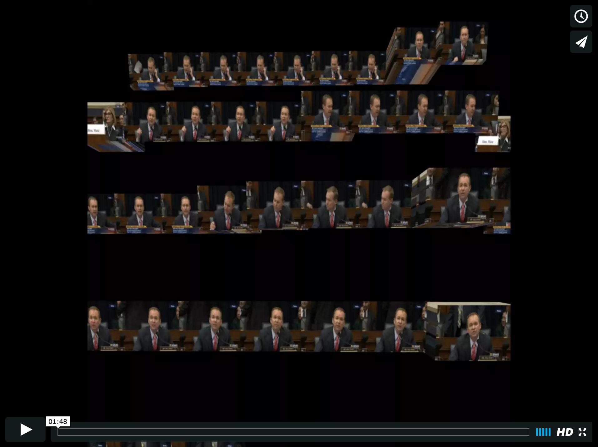
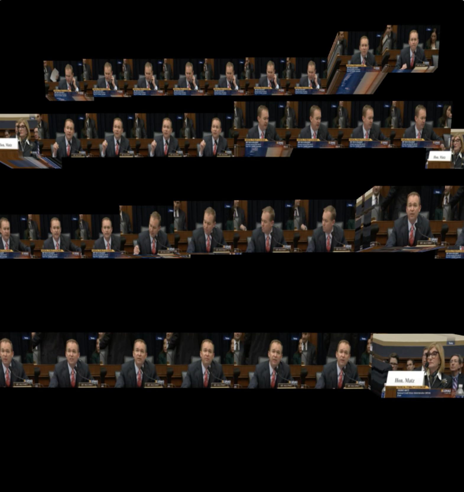

# Final Project: *Dare to be Boring*

[](https://vimeo.com/148319462 "Dare to be boring")


## Concept

Inspired by Martin Hilpoltsteiner's _Recreating Movement_, I wanted to reimagine the way we consume video, or motion over time, in a single, simultaneous visualization -- turning video into glanceable summaries irrespective of time. I chose to stack frames in space such that scenes with significant motion would be expanded, while scenes with little action would be compressed. I estimate motion between frames using optical flow, via the OpenCV library in Processing. 

I initially thought this type of visual summary would be interesting if applied on surveillance footage, to highlight the "action" (or lack thereof), and thus emphasize the mundaneness of constant monitoring. In looking for public surveillance footage from the US government, I instead found C-SPAN live-streaming a hearing on "Financial Stability Oversight Council Operations", which was interesting as far as reversing the roles, the public surveilling the US government. Just as mundane. 



## Process

The technical challenges was mostly in 1) finding the right optical flow value (threshold) to determine frame expansion/compression and 2) displaying the frames legibly.


_Processing:_
* Load video
* Play video while printing optical flow magnitudes
* Choose appropriate threshold for frame expansion/compression as desired
* Adjust canvas rotation and translation parameters as desired


```java
import gab.opencv.*;
import processing.video.*;

OpenCV opencv;
Movie video;

int count = 0;
int x = -70;
int y = 100;
float trans = 0.0;

void setup() {
  
  size(800, 1000, P3D);
  background(0);
  video = new Movie(this, "cspan.mov");
  opencv = new OpenCV(this, 80, 60);
  frameRate(15);
  video.play();

 }

void draw() {
    
    pushMatrix();
    video.read();
  
    opencv.loadImage(video);
    opencv.calculateOpticalFlow();
    
    //store total optical flow from prior frame to current frame
    PVector aveFlow = opencv.getTotalFlow();

    //calculate the magnitude of total optical flow vector
    float flowMag = aveFlow.mag();
    println(flowMag);
    
    //translate frame by width of frame if above threshold, otherwise keep compressed
    if(flowMag > 6000) {
      if(!Float.isNaN(flowMag)) {trans = trans + 70;}
      //if(!Float.isNaN(flowMag)) {trans = trans + x*flowMag*0.0000001 + 60;}
      translate(trans,0,x*0.3);
    }
    else {
      //if(!Float.isNaN(flowMag)) {trans = trans;}
      //if(!Float.isNaN(flowMag)) {trans = trans + x*flowMag*0.0000001;}
      translate(trans,0,x*0.3);
    }
    
    rotateX(-PI/18);
    //rotateY(PI/36);
    
    //if image reaches edge, start drawing on new row
    if(trans > 650){
    trans = 50;
    y += 150;
    }
    
    //draw image  
    image(video, 0, y, 80, 60);

    x++;
    popMatrix();
}
```


## Special thanks to:
C-SPAN